# **Assignment 1 Report**  

#### CSCI 5743: Cyber and Infrastructure Defense, Fall 2025  

**Name & Student ID**: Yaseer Sabir, 111158157  

---

# **Section 1: Conceptual Assignments**  

## **Task 1: Cybersecurity Incident Analysis**  

### **Incident 1**: SolarWinds Supply Chain Attack(2020)
#### **1. Attack Overview**  
- **Targeted Organization:**  Supply chains across sectors like the government, consulting, technology, and telecom and other organizations in North America, Europe, Asia, and the Middle East
- **Summary of Attack:** This was a sophisticated supply chain cyber operation conducted by APT29 that was discovered in mid-December 2020. APT29 used customized malware to inject malicious code into the SolarWinds Orion software build process that was later distributed through a normal software update.
- **Impact:** The US government assessed that there were approximately 18,000 affected public and private sector customers of Solar Winds' Orion product.

#### **2. Key Technical Methods Used**  
- **Technique 1:** Customized Malware: The malware which included SUNBURST, SUNSPOT, Raindrop and TEARDROP were embedded directly into legitimate, digitally signed SolarWinds Orion Software updates. It was programmed to detect security tools and remain inactive if found, used steganographic techniques to hide communications, and provided comprehensive backdoor capabilities, all while appearing as legitimate software behavior.
- **Technique 2:** Password Spraying: This was used as a post-compromise technique for lateral movement and expanding beyond the initial customized malware backdoor. Through initial access by password guessing and password spraying they moved laterally from on-premise networks to gain unauthorised access to the victim's Microsoft 365 environment.
- **Technique 3:** Token Theft: This was accomplished through an attack called "Golden SAML". In this, the actors stole the token-signing certificate to forge SAML tokens. This enabled the actors to bypass the federated resource provider's Multi-Factor Authentication and password requirements. This token-theft technique allowed the attackers to maintain persistent access to cloud environments while completely bypassing security features like Multi Factor Authentication.

#### **3. Threat Actor Classification**  
- **Type of Attacker (Nation-state, cybercriminal, etc.):** Nation-State Actor, particularly Russia's Foreign Intelligence Service, which is a state-sponsored intelligence agency.  
- **APT Group (if known):** APT29(Cozy Bear)

#### **4. Violated Security Goals (CIA Triad)**  
- **Confidentiality:** Severely Compromised- Attackers gain unauthorized access to sensitive government and corporate data across thousands of organizations, thus compromising confidentiality.
- **Integrity:** Compromised- The attack violated data and system integrity by injecting malicious code into trusted software updates. The adversary created unauthorized but valid tokens, corrupting the authentication system's integrity.
- **Availability:** Minimally Impacted- This is because the attackers prioritized having long-term access to the systems rather than causing downtime. However, when the compromise was discovered, the systems had to be taken offline.

#### **5. Defensive Measures**  
- **Defense 1:** Network Segmentation and Egress Filtering(Confidentiality and Availability): A firewall blocking all outgoing connections to the internet would have neutralized the SolarWinds malware and prevent it from communicating with its command and control servers, protecting confidentiality by preventing data exfiltration and maintaining availability by stopping the attack progression.  
- **Defense 2:** Enhanced Software Supply Chain Security(Integrity)- It's important to take note that the injected malicious code was later distributed through a normal software update. Thus, robust software supply chain security measures should be implemented this doesn't go unnoticed, such as, multi-party code signing verification and build process integrity monitoring.
- **Defense 3:** Multi-Factor Authentication(Confidentiality)- Implementing MFA across all systems, especially for privileged accounts, and robust privileged access management would've significantly limited the attackers' ability to escalate privileges and move laterally through the networks. This thus would've protected the confidentiality aspect by preventing unauthorized access to the systems.
---

### **Incident 2**: APT41 DUST
#### **1. Attack Overview**: 
- **Targeted Organization:** Organizations primarily across Europe, Asia, and the Middle East, with notable targets in Italy, Spain, Thailand, Turkey and the U.K. It specifically targeted industries such as shipping & logistics, media & entertainment, technology and automotive sectors.
- **Summary of Attack:** APT41, also known as Wicked Panda, executed a sustained cyber espionage campaign from January 2023 to June 2024 to target various sectors across the world, to target various sectors using web shells and custom malware and gain unauthorized access and perform large-scale data theft.
- **Impact:** Attackers gained long-term, stealthy access to victim networks and exfiltrated large volumes of sensitive corporate data. The operation threatened supply chains, intellectual property and business operations across multiple regions.

#### **2. Key Technical Methods Used**  
- **Technique 1:** Web Shells- Attackers implanted ANTSWORD and BLUEBEAM web shells on vulnerable servers which gave them persistent remote access to execute commands, upload files, and move deeper into the network
- **Technique 2:** Custom Malware- A malware, known as DUSTPAN was deployed to load the Beacon backdoor, and later executed DUSTTRAP, which decrypted and executed payloads directly in memory. This technique helped them avoid leaving traces on disk, making detection by traditional antivirus tools very difficult.
- **Technique 3:** Cloud-Based Data Exfiltration- The attackers used tools like SQLULDR2 to extract database records, staged the data, compressed it, and uploaded into attacker-controlled Microsoft OneDrive accounts which blended with normal cloud traffic. This helped them exfiltrate sensitive data without raising suspicion.

#### **3. Threat Actor Classification**  
- **Type of Attacker (Nation-state, cybercriminal, etc.):** Nation-State Actor, specifically Chinese state-sponsored threat group.
- **APT Group (if known):** APT41

#### **4. Violated Security Goals (CIA Triad)**  
- **Confidentiality:** Severely Compromised: Attackers exfiltrated large amounts of sensitive corporate data. This represents a direct breach of confidentiality since unauthorized actors accessed and stole private information.
- **Integrity:** Minimal- The focus here was espionage and theft, not tampering with data
- **Availability:** Minimal- Again, the campaign did not aim to disrupt systems.

#### **5. Defensive Measures**  
- **Defense 1:** Web Application Firewall(For Confidentiality)- Since APT41 gained initial access through web shells on vulnerable servers, using a Web Application Firewall (WAF) and regularly patching web-facing applications could have blocked malicious requests and thus helped maintain confidentiality.
- **Defense 2:** Memory Monitoring(For Confidentiality and Integrity)- The attackers used memory-resident malware(DUSTPAN, DUSTTRAP) to avoid leaving traces on the disk. Using Endpoint Detection and Response(EDR) solutions with memory scanning could've detected suspicious in-memory execution and thus preserving confidentiality(stopping data theft) and integrity(preventing attackers from executing malicious payloads undetected)
- **Defense 3:** Cloud Traffic Monitoring: APT41 exfiltrated sensitive data via Microsoft OneDrive. Implementing Data Loss Prevention tools and monitoring for unusual outbound cloud traffic could've flagged these transfers, which in turn safeguards confidentiality by preventing unauthorized data access outside the organization.

---

## **Task 2: Understanding APTs and MITRE ATT&CK**  

### **Tactic 1: Initial Access, ID: TA0001**  
#### **1. Overview**  
- **Purpose of the tactic:** The purpose of this tactic is to get an initial access into a network. Attackers use various entry vectors to gain their initial foothold within a network.
- **Real-world example:** An example of Initial Access is the 2021 Colonial Pipeline ransomware attack. Attackers gained their foothold through a compromised VPN account that still had access but lacked multi-factor authentication (MFA). Once inside, they were able to move deeper into the network and launch ransomware, disrupting fuel supply across the U.S. East Coast.

#### **2. Techniques Used Under This Tactic**  
- **Technique 1:** Content Injection
  - **MITRE ATT&CK ID:** T1659
  - **Platforms Affected:** Linux, Windows, macOS
  - **Required Permissions:** Network-level access
  - **Associated Tactic(s):** Initial Access, Command and Control
  - **Description:**
    - 2 ways adversaries may inject contect to victim systems in various ways
      - In the middle: where the adversary is in-between legitimate online client-server communications
      - From the side: where malicious content is injected and races to the client as a fake response to requests of a legitimate online server.
  - **Sub-techniques (if any):** No sub-techniques
  - **Adversary Goals:** To gain access and continuously communicate with victims by injecting malicious content into systems through online newtork traffic
  - **APT Groups/Campaigns Using This Technique:**
    - Disco- This group achieved initial access and execution through content injection into DNS, HTTP, and SMB replies to targeted hosts that redirect them to download malicious files. For example, An employee attempts to access their company’s internal file share. The SMB traffic is intercepted, and Disco injects a malicious redirect into the reply. Instead of connecting to the real file share, the employee unknowingly downloads and executes a trojanized installer, giving the attackers their first foothold in the network.
    - MoustachedBouncer- This group injected content into DNS, HTTP, and SMB replies to redirect specifically-targeted victims to a fake Windows Update page to download malware. For example, a government official browsing the web is transparently redirected by a manipulated DNS response. Instead of Microsoft’s genuine servers, they land on a fake Windows Update page crafted by MoustachedBouncer. Believing they are installing critical patches, the victim executes the malware, which grants the attackers persistent access and surveillance capabilities.
  - **Detection Strategies:**
    - File Creation: Monitor for unexpected and abnormal file creations that may indicate malicious content injected through online network communications.
    - Network Traffic Content: Monitor for other unusual network traffic that may indicate additional malicious content transferred to the system. Use network intrusion detection systems, sometimes with SSL/TLS inspection, to look for known malicious payloads, content obfuscation, and exploit code.
    - Process Creation: Look for behaviors on the endpoint system that might indicate successful compromise, such as abnormal behaviors of browser processes. This could include suspicious files written to disk, evidence of Process Injection for attempts to hide execution, or evidence of Discovery.
  - **Mitigation Strategies:**
    - Encrypt Sensitive Information: Where possible, ensure that online traffic is appropriately encrypted through services such as trusted VPNs.
    - Restrict Web-Based Content: Consider blocking download/transfer and execution of potentially uncommon file types known to be used in adversary campaigns.

- **Technique 2:** Drive-by Compromise
  - **MITRE ATT&CK ID:** T1189
  - **Platforms Affected:** Identity Provider, Linux, Windows, macOS
  - **Required Permissions:** User-level permissions.
  - **Associated Tactic(s):** Initial Access
  - **Description:**  
    - A user visits a website that is used to host the adversary controlled content
    - Scripts automatically execute, typically searching versions of the browser and plugins for a potentially vulnerable version. The user may be required to assist in this process by enabling scripting, notifications, or active website components and ignoring warning dialog boxes.
    - Upon finding a vulnerable version, exploit code is delivered to the browser.
    - If exploitation is successful, the adversary will gain code execution on the user's system unless other protections are in place. In some cases, a second visit to the website after the initial scan is required before exploit code is delivered.
  - **Sub-techniques (if any):** None
  - **Adversary Goals:** To gain access to a system through a user visiting a website over the normal course of browsing.
  - **APT Groups/Campaigns Using This Technique:**
    - APT19: They performed a watering hole attack on Forbes.com in 2014 to compromise targets. The group injected malicious code into the site’s “Thought of the Day” feature, which then served zero-day exploits in Internet Explorer and Adobe Flash. 
      - For example, a defense contractor employee visits Forbes.com during lunch. Without clicking anything, the compromised “Thought of the Day” widget exploits an unpatched Flash plugin on their system and installs a backdoor. APT19 then leverages this foothold to infiltrate the contractor’s corporate network, access sensitive design documents, and maintain long-term persistence.
    - Daggerfly: They used strategic website compromise for initial access against victims. By compromising legitimate websites that their targets frequently visited, Daggerfly was able to deliver malicious code or exploit kits that installed backdoors. This gave them stealthy entry into networks within the telecommunications and pro-democracy sectors, enabling long-term espionage without needing to rely on phishing campaigns. 
      - For example, a pro-democracy activist regularly visits the website of a trusted NGO for updates. Unknown to them, the site has been compromised by Daggerfly. A hidden script executes in their browser, dropping a remote access trojan (RAT) that allows attackers to monitor communications, steal documents, and track the activist’s activities over months.
  - **Detection Strategies:**
    - Network monitoring: Looking for suspicious traffic by checking known malicious domains or unusual HTTP/S requests
    - Endpoint detection: Monitoring browser processes spawning unusual child processes
    - Web proxy/Firewall logs: Identifying requests to sites flagged as watering holes or linked to exploit kits
  - **Mitigation Strategies:**  
    - Application Isolation and Sandboxing: Browser sandboxes can be used to mitigate some of the impact of exploitation, but sandbox escapes may still exist
    - Exploit Protection: Security applications that look for behavior used during exploitation such as Windows Defender Exploit Guard (WDEG) and the Enhanced Mitigation Experience Toolkit (EMET) can be used to mitigate some exploitation behavior.

---

### **Tactic 2: Lateral Movement, ID: TA0008**  
#### **1. Overview**  
- **Purpose of the tactic:** The purpose of this tactic is to move through one's environment. It consists of techniques that adversaries use to enter and control remote systems on a network. 
- **Real-world example:** An example of lateral movement is the 2017 NotPetya cyberattack. In this, attackers used stolen credentials, SMB exploits, and tools like PsExec to spread from one infected computer across entire corporate networks crippling companies like FedEx.

#### **2. Techniques Used Under This Tactic**  
- **Technique 1:** Exploitation of Remote Services
  - **MITRE ATT&CK ID:**  T1210
  - **Platforms Affected:**  ESXi, Linux, Windows, macOS
  - **Required Permissions:** Network-level access to the target system. Depending on the vulnerability, this may succeed with low-privileged user accounts.
  - **Associated Tactic(s):** Lateral Movement
  - **Description:**  
    - The adversary must first gain some level of access to the internal network.
    - Once inside, the attacked uses Network Service Discovery techniques to identify systems running vulnerable remote services such as SMB(Server Message Block) and RDP(Remote Desktop Protocol).
    - Then, the attacker exploits a programing error in the remote service, which could involve sending malicious input to the service.
    - After gaining control, the attacker may move laterally across the network to access other machines and even escalate privileges.
  - **Sub-techniques (if any):** No sub-techniques
  - **Adversary Goals:** The goal is to exploit remote services to gain unauthorized access to internal systems once inside of a network
  - **APT Groups/Campaigns Using This Technique:**
    - APT28: The group exploited a Windows SMB Remote Code Execution vulnerability to move laterally within compromised environments. After initial access, they used the flaw to execute malicious code on other systems across the network. For example, APT28 compromises a single endpoint through phishing, then exploits the SMB RCE flaw to move laterally. This enables them to execute malicious payloads on file servers and domain controllers, ensuring deeper persistence and access to sensitive organizational data.
    - Bad Rabbit: In its 2017 ransomware campaign, Bad Rabbit leveraged the EternalRomance SMB exploit to spread rapidly through victim networks. Once a single machine was infected, the malware scanned for additional vulnerable systems and propagated laterally via the SMB protocol. For example, Bad Rabbit infects one machine via a fake Flash update, then uses EternalRomance to scan the local network for other vulnerable hosts. Within minutes, multiple systems are encrypted, halting business operations and forcing the organization into incident response.
  - **Detection Strategies:**
    - Application Log: This may be difficult depending on the tools available. Web Application Firewalls may detect improper inputs attempting exploitation.
    - Network Traffic: Use deep packet inspection to look for artifacts of common exploit traffic, such as known payloads.
    
  - **Mitigation Strategies:**  
    - Application Isolation and Sandboxing: This is making it difficult for adversaries to advance their operation through exploitation of undiscovered or unpatched vulnerabilities by using sandboxing.
    - Disable or Remove Feature or Program: Minimize available services to only those that are necessary.

- **Technique 2:** Internal Spearphishing  
  - **MITRE ATT&CK ID:** T1534 
  - **Platforms Affected:** Linux, Office Suite, SaaS, Windows, macOS 
  - **Required Permissions:**
    - Adversaries need valid usernames and passwords
    - They need access to internal communication platforms such as Outlook, Slack, or other corporate email/chat systems
  - **Associated Tactic(s):** Lateral Movement  
  - **Description:**
    - After having access to accounts or systems within the environment, adversaries may use internal spearphishing to gain access to additional information.
    - It is a multi-staged campaign where a legitimate account is initially compromised either by controlling the user's device or by compromising the account credentials of the user.
    - Adversaries may then take advantage of the trusted internal account to increase likelihood of tricking more victims into falling for phish attempts
  - **Sub-techniques (if any):** No sub-techniques
  - **Adversary Goals:** Adversaries use this to gain access to additional information or compromise other users within the same organization. 
  - **APT Groups/Campaigns Using This Technique:**
    - Gamaredon Group: They used an Outlook VBA module on infected systems to send phishing emails with malicious attachments to other employees within the organization. For example, Gamaredon infects an employee’s system, installs a malicious VBA module in Outlook, and that module automatically emails weaponized attachments to the victim’s coworkers. Since the emails come from a trusted internal account, colleagues are more likely to open the attachments, leading to further compromise across the organization.
    - HEXANE: They conducted internal spearphishing attacks against executives, HR, and IT personnel to gain information and access. For example, HEXANE, after gaining an initial foothold, impersonates employees and sends spearphishing messages to HR and IT. By tricking staff into revealing credentials, HEXANE gains access to higher-privilege accounts and sensitive internal systems.
  - **Detection Strategies:**
    - Application Log: An organization can leverage the journaling-based solution which sends a copy of emails to a security service for offline analysis or incorporate service-integrated solutions using on-premise or API-based integrations to help detect internal speakphishing attacks.
    - Network Traffic: Communication traffic can be monitored containing suspicious payloads or URLs, especially those associated with internal email or chat systems. Also an analysis can be done for outbound or inbound traffic related to known or newly registered domains that could be used for credential phishing or payload delivery.
    - Network Traffic Flow: Monitor network data for uncommon data flows. Processes utilizing the network that do not normally have network communication or have never been seen before are suspicious.  
  - **Mitigation Strategies:**
    - This type of attack cannot be easily mitigated with preventive controls since it's based on the abuse of system features. 

---
### **Tactic 3: Exfiltration, ID: TA0010**

#### **1. Overview**

- **Purpose of the tactic:** The purpose of the tactic is to steal data from a victim
- **Real-world example:** For example, an employee with access to financial spreadsheets decides to take them when leaving the company. They plug in a personal USB drive, copy the files, and compress them into a password-protected ZIP file named holiday_photos.zip to avoid suspicion. By disguising the data and physically removing it, they bypass network monitoring controls and successfully exfiltrate sensitive company information.

#### **2. Techniques Used Under This Tactic**

- **Technique 1:** Automated Exfiltration
  - **MITRE ATT&CK ID:** T1020
  - **Platforms Affected:** Linux, Network devices, Windows, macOS
  - **Required Permissions:** 
    - Attackers on a minimum basis need read access to the data they want to exfiltrate. They need also need system access to copy or stage that data, network access to send the data out to the web services and optional elevated privileges like admin priviliges if the data is located in protected directories.
  - **Associated Tactic(s):** Exfiltration
  - **Description:**
    - Attackers use automation to steal sensitive data quickly and in large volumes.
    - Automated exfiltration often leverages other methods, such as C2 channels or alternative protocols, to move data out of the network.
    - This makes detection harder since automation can disguise malicious activity as normal traffic.
  - **Sub-techniques (if any):** Traffic Duplication, ID: T1020.001
    - In this sub-technique, adversaries leverage traffic mirroring in order to automate data exfiltration over compromised infrastructure. 
  - **Adversary Goals:**
    - Adversaries aim to steal sensitive data without detection by setting up automated processes
    - They try to maintain persistance in data theft instead of one time manual exfiltration
  - **APT Groups/Campaigns Using This Technique:**
    - Attor:
      - They has a file uploader plugin that automatically exfiltrates the collected data and log files to the C2 server. 
      - Attor has targeted government institutions and diplomatic organizations in Europe, using modular malware that automates data collection and exfiltration. 
      - An adversary like Attor infiltrates a government network and deploys its modular malware. Once sensitive documents and system logs are collected, the uploader plugin automatically sends the data to the attacker’s C2 server.
    - CosmikDuke: 
      - They exfiltrated collected files automatically over FTP to remote servers.
      - CosmicDuke has been linked to espionage campaigns against political figures, energy companies, and research institutions, where data was systematically exfiltrated using automated FTP uploads.
      - An example would be: CosmicDuke compromises a research organization, gathers sensitive project files, and then automatically transfers them to attacker-controlled FTP servers, blending the activity into normal network traffic.
  - **Detection Strategies:**
    - Command Execution: Monitor execution of exfiltration-related commands such as scp, rsync, curl, ftp, wget, command-line utilities used to archive and move data (tar, zip, 7z), suspicious execution of scripts performing batch file transfers, or unusual usage of PowerShell, Bash, or Python for bulk file movement.
    - File Access: Monitor for abnormal access to files (i.e. .pdf, .docx, .jpg, etc.), especially sensitive documents, through the use of automated processing after being gathered during Collection.
    - Network Connection Creation: Monitor for newly constructed network connections associated with processes performing collection activity, especially those involving abnormal/untrusted hosts.
  - **Mitigation Strategies:**
    - This type of attack technique cannot be easily mitigated with preventive controls since it is based on the abuse of system features.
  
- **Technique 2:** Data Transfer Size Limits
  - **MITRE ATT&CK ID:** T1030
  - **Platforms Affected:** ESXi, Linux, Windows, macOS
  - **Required Permissions:**
    - They need read access to the data for exfiltration, network access to transmit data outside the system, write permissions to stage files, and elevated privileges if the adversary is targeting protected system data.
  - **Associated Tactic(s):** Exfiltration
  - **Description:**
    - Adversaries may split large data sets into smaller chunks to avoid detection and bypass network data transfer size limitations. 
    - Security tools and monitoring systems often flag unusually large outbound transfers, so attackers fragment data into smaller pieces that appear less suspicious. 
    - These chunks may then be exfiltrated sequentially or disguised as normal traffic, making it harder for defenders to detect data theft in progress.
  - **Sub-techniques (if any):** No sub-techniques
  - **Adversary Goals:**
    - Evade detection by security monitoring systems that track large or abnormal network transfers.
    - Successfully exfiltrate large volumes of data by breaking it into smaller, inconspicuous portions.
    - Maintain persistence in data theft campaigns by ensuring data transfers remain hidden within normal network traffic patterns.
  - **APT Groups/Campaigns Using This Technique:**
    - AppleSeed: 
      - Known to divide files if the size reaches 0x1000000 bytes or more before exfiltration.
      - They have been linked to espionage operations targeting South Korean organizations, using malware that ensures stolen data is split into smaller files before being sent to attacker infrastructure.
      - For example, AppleSeed deployes malware on targeted systems that automatically divided files larger than 0x1000000 bytes, ensuring that exfiltration proceeded in smaller, less suspicious segments.
    - APT28:
      - Has split archived exfiltration files into chunks smaller than 1MB to avoid detection
      - APT28, a Russian state-sponsored group, has conducted large-scale campaigns against government and military targets in Europe and the U.S., often exfiltrating sensitive files in small fragments to bypass network monitoring and detection systems.
      - For example, in one intrusion, APT28 gained access to a government network, archived sensitive documents, and then split the archives into multiple files smaller than 1MB. These files were gradually exfiltrated, blending into normal traffic patterns and avoiding triggers for large data transfers.
  - **Detection Strategies:**
    - Network Connection Creation: Monitor for processes that initiate persistent outbound connections with steady data transfer, multiple small-sized data transfers within a short timeframe to external destinations, network connections originating from unexpected processes or unauthorized ports, or repeated use of the same destination for outbound traffic across multiple sessions.
    - Network Traffic Flow: Monitor and analyze traffic flows that do not follow the expected protocol standards and traffic flows.
      - Consider correlation with process monitoring and command line to detect anomalous processes execution and command line arguments associated to traffic patterns.
  - **Mitigation Strategies:**
    - 	Network Intrusion Prevention: At the network level, network intrusion detection and prevention systems that use network signatures to identify traffic for specific adversary command and control infrastructure and malware can be used to mitigate potential activity.
  
---

## **Task 3: Research on Two APT Groups**  

### **APT Group 1: APT28**  
#### **1. Overview**  
- **Known Aliases:** IRON TWILIGHT, SNAKEMACKEREL, Swallowtail, Group 74, Sednit, Sofacy, Pawn Storm, Fancy Bear, STRONTIUM, Tsar Team, Threat Group-4127, TG-4127, Forest Blizzard, FROZENLAKE, GruesomeLarch
- **Country of Origin (if applicable):** Russia
- **Primary Motivation (Espionage, financial, disruption):** Espionage- This group is primarily driven by espionage—state-sponsored intelligence gathering on Ukraine-related organizations. This supports Russia’s geopolitical and military objectives, particularly by leveraging proximity-based Wi-Fi exploitation and dual-homed system infiltration to discreetly access sensitive information

#### **2. Key Cyber Campaigns**  
- **Campaign 1:**  APT28 Nearest Neighbor Campaign
  - **Timeframe:** February 2022 to November 2024
  - **Targeted Organizations/Sectors:** This was against organizations and individuals with expertise on Ukraine
  - **Impact:** APT28 specifically targeted individuals and organizations working on Ukraine-related matters. Through this, Attackers gained persistent network access by exploiting compromised Wi‑Fi connections. 

- **Campaign 2:** Please note: Only one campaign exists for this APT. Another APT is added below to meet the 2 cyber campaigns requirement.

#### **3. Primary Objectives**
- The primary objectives of APT28 mainly reside in advancing Russian state interests:-
  - Espionage: Stealing sensitive political, military, and diplomatic information.
  - Political Influence & Destabilization: Supporting disinformation campaigns that align with Kremlin narratives.
  - Strategic & Military Advantage: Gathering intelligence on NATO operations and Western military strategies.

#### **4. Primary Attack Techniques**  
- **Technique 1 (MITRE ID):** Access Token Manipulation: Token Impersonation/Theft (T1134.001):
  - APT28 has used CVE-2015-1701 to access the SYSTEM token and copy it into the current process as part of privilege escalation
- **Technique 2 (MITRE ID):** Account Manipulation: Additional Email Delegate Permissions(T1098.002):
  - APT28 has used a Powershell cmdlet to grant the ApplicationImpersonation role to a compromised account.
- **Technique 3 (MITRE ID):** Acquire Infrastructure: Domains( T1583.001)
  - APT28 registered domains imitating NATO, OSCE security websites, Caucasus information resources, and other organizations.  

#### **5. Industries / Organizations Targeted**
- Government Agencies (especially foreign ministries, defense, and security organizations)
- Military & Defense Contractors (NATO, U.S. Department of Defense, European defense agencies)
- Media & Journalism (outlets covering Russian political/military activities)
- Energy & Critical Infrastructure
- Political Organizations notably the Democratic National Committee during the 2016 U.S. elections.
- Aerospace & Research Institutions.

#### **6. Violated Security Goals (CIA Triad)**

**Confidentiality:** 
  - Primary violation: APT28 frequently breaches confidentiality by stealing sensitive government, military, political, and corporate information. Examples include spear-phishing campaigns and credential harvesting that led to the compromise of email systems.

**Integrity:** 
  - They have undermined integrity by altering or weaponizing stolen information. For instance, during election interference operations, leaked documents were selectively modified or strategically released to misinform and influence public opinion.

**Availability:** 
  - This is less common for APT28. But the group has conducted denial-of-service (DoS) attacks and deployed malware. These incidents temporarily disrupted systems and services, showing their capability to compromise availability.

---

### **APT Group 2: Sandworm Team**  

#### **1. Overview**  
- **Known Aliases:**  ELECTRUM, Telebots, IRON VIKING, BlackEnergy (Group), Quedagh, Voodoo Bear, IRIDIUM, Seashell Blizzard, FROZENBARENTS, APT44
- **Country of Origin (if applicable):**  Russia
- **Primary Motivation (Espionage, financial, disruption):**  The primary motivation is disruption, rather than espionage or financial gain. An example of this is the 2017 NotPetya attack, which masqueraded as ransomware but was actually designed to cause maximum destruction globally, crippling businesses and infrastructure.

#### **2. Key Cyber Campaigns**  
- **Campaign 1:** 2022 Ukraine Electric Power Attack 
  - **Timeframe:** June 2022 to October 2022
  - **Targeted Organizations/Sectors:**  Electric utility infrastructure, private energy companies, and critical civilian sectors were the target sectors in this attack.
  - **Impact:**  
    - Up to 30% of power stations were destroyed in a short period, and 40–50% of generation capacity was impaired or taken offline
    - There were mass power outages and blackouts across major cities such as Kyiv, Lviv, Zhytomyr, Dnipro, and others.
    - At least 77 civilians killed and hundreds injured as part of broader infrastructure attacks.
  
- **Campaign 2:** Please note: Only one campaign exists for this APT. Another APT is added below to meet the 2 cyber campaigns requirement.

#### **3. Primary Objectives**
- Disrupt Critical Infrastructure Operations: They wanted to target Ukraine’s electric grid (power plants, substations, distribution systems) to cause blackouts.
- Weaken Civilian Morale & Resilience: They wanted to use power outages as a form of psychological and humanitarian pressure—leaving homes, hospitals, and schools without electricity or heating, especially ahead of winter.
- Strategic Military Advantage: Also, in a way they wanted to undermine Ukraine’s defensive and logistical capacity.

#### **4. Primary Attack Techniques**  
- **Technique 1 (MITRE ID):**  Command and Scripting Interpreter: PowerShell(T1059.001)
  - They used a PowerShell utility called TANKTRAP to spread and launch a wiper via Windows Group Policy.
- **Technique 2 (MITRE ID):**  Create or Modify System Process: Systemd Service(T1543.002)
  - The team configured Systemd persistence for GOGETTER, using the WantedBy=multi-user.target configuration to automatically run when the system accepted user logins.
- **Technique 3 (MITRE ID):**  Data Destruction(T1485): 
  - Sandworm Team deployed CaddyWiper to erase files in the IT environment, targeting OT-related files, mapped drives, and physical drive partitions

#### **5. Industries / Organizations Targeted**
- Electric Utilities & Energy Infrastructure: Key targets included electric substations, thermal and hydroelectric power plants, and SCADA/OT systems managing grid operations
- ISPs and Energy Sector IT: Attackers infiltrated corporate networks and SCADA environments via techniques like web shells, lotL tools, and wiper malware like CaddyWiper to disrupt operational infrastructure 

#### **6. Violated Security Goals (CIA Triad)**

- **Confidentiality:**
  - Minimal impact. The campaign focused on disruption rather than espionage, with no significant evidence of sensitive data theft.
- **Integrity:**
  - Severely compromised. Attackers deployed CaddyWiper to erase drive partitions and OT-related files.
- **Availability:**
  - Critically impacted. The campaign targeted service interruptions, issuing unauthorized SCADA commands to disable substations and generating widespread blackouts

---

### **APT Group 3: Volt Typhoon**  

#### **1. Overview**  
- **Known Aliases:** BRONZE SILHOUETTE, Vanguard Panda, DEV-0391, UNC3236, Voltzite, Insidious Taurus
- **Country of Origin (if applicable):** People's Republic of China
- **Primary Motivation (Espionage, financial, disruption):** The group's primary motivation is Espionage (state-sponsored intelligence gathering), with potential disruptive capabilities reserved as a strategic option.

#### **2. Key Cyber Campaigns**  
- **Campaign 1:** KV Botnet Activity
  - **Timeframe:** October 2022 to January 2024
  - **Targeted Organizations/Sectors:**  
    - Energy sector companies - utilities and operators tied to national power grid operations.
    - Telecommunication companies – providers of internet, communication, and data services, especially those with infrastructure in Guam and across the Pacific
  - **Impact:**
    - Obfuscation of Operations: Used compromised SOHO devices (Cisco, NETGEAR, DrayTek, etc.) as proxies to hide attacker traffic and make malicious activity appear as normal internet traffic.
    - Stealth & Persistence: Allowed Volt Typhoon to maintain long-term access in victim environments while avoiding detection by blending in with legitimate network activity.
    - Targeted Critical Infrastructure: Enabled covert access to energy and telecommunication companies, including systems in Guam, a strategically critical U.S. territory.  

- **Campaign 2:**  Versa Director Zero Day Exploitation
  - **Timeframe:**  June 2024 to August 2024
  - **Targeted Organizations/Sectors:**
    - Managed Service Providers – They were compromised to harvest credentials and pivot into their customer networks.
    - Internet Service Providers – They were targeted to gain access to client environments and intercept communications.
    - Service Provider Clients – any organizations relying on MSPs/ISPs for SD-WAN connectivity, including critical infrastructure customers, became exposed through supply-chain style compromise.  
  - **Impact:**  
    - Credential Theft: Captured admin and user credentials from compromised Versa Director servers.
    - Follow-on Access: Enabled pivoting into MSP and ISP client networks, expanding the attack surface.
    - Supply-Chain Risk: Exposed downstream critical infrastructure organizations dependent on those providers.

#### **3. Primary Objectives**
- Espionage & Intelligence Gathering: Collect sensitive information from U.S. critical infrastructure sectors (energy, communications, transportation, water, and defense-related industries).
- Pre-positioning for Potential Disruption: Establish footholds in operational technology (OT) and IT environments to enable lateral movement.
- Stealthy Persistence: Emphasize covert operations by using web shells, living-off-the-land (LOTL) techniques, stolen credentials, and compromised SOHO devices (e.g., KV Botnet) to blend into legitimate traffic and evade detection.

#### **4. Primary Attack Techniques**  
- **Technique 1 (MITRE ID):** Application Layer Protocol: Web Protocols(T1071.001)
  - This technique established HTTPS communications from adversary-controlled SOHO devices over port 443 with compromised Versa Director servers.
- **Technique 2 (MITRE ID):** Compromise Infrastructure: Network Devices(T1584.008)
  - This attack used compromised small office/home office (SOHO) devices to interact with vulnerable Versa Director servers.
- **Technique 3 (MITRE ID):** Develop Capabilities: Malware(T1587.001)
  - This attack involved the development of a new web shell variant, VersaMem.

#### **5. Industries / Organizations Targeted**
- Critical Infrastructure Sectors – energy, communications, transportation, and water.
- Service Providers – managed service providers (MSPs), internet service providers (ISPs), and network equipment vendors.
- U.S. Territories – notably Guam, due to its strategic role in U.S. military and communication operations.

#### **6. Violated Security Goals (CIA Triad)**
- **Confidentiality:** High severity- Extensive credential theft from MSPs/ISPs and network equipment, exposing sensitive data and enabling stealthy access across critical infrastructure.
- **Integrity:** Medium Severity- Altered system behavior via web shells (e.g., VersaMem), manipulation of network devices, and covert traffic redirection through the KV Botnet. While damaging, these actions focused more on persistence than direct data corruption.
- **Availability:** Medium to High Severity- No widespread destructive attacks were executed, but pre-positioning in OT and IT systems gave Volt Typhoon the capability to disable or disrupt essential services

---

## **Task 4: Reflection and Analysis**  

### **1. Challenges in Detecting APTs**  
*(100–125 words)*  
  There are many unique challenges in detecting Advanced Persistant Threats(APTs). APTs use sophisticated tools and techniques to breach systems and maintain access. They do so all while remaining undetected. One of the ways is that they really embed themselves within the system for weeks, months or even years. This persistance lets them carefully monitor activity and execute their objectives without detection. These groups are also well-funded, which gives them access to highly specialized tools. They also use existing tools liks Powershell and WMI for getting into systems instead of introducing new malware. Since these tools are already trusted by the operating system, their use doesn't trigger a security alert.
### **2. Challenges in Defending Against APTs**  
*(100–125 words)*  
  There are quite a few challenges in defending against APTs. As defensive systems become stronger and stronger, APT actors developer newer methods to bypass them. This makes it difficult to defend against these newer methods. Zero-day exploits are an example of such attacks by APT attackers who take advantage of vulnerabilities before an organization can release a patch for it. In addition to, supply chain attacks(as discussed in the SolarWinds attack above) demonstrate how APTs can take advantage of vendors with weaker security measures. By compromising a single software update, attackers can compromise the software of the many vendors that utilize this software.

### **3. Insights from Researching APTs and MITRE ATT&CK**  
*(100–125 words)*  
  Studying real-world APT groups really changed my perspective on cybersecurity. Before this course(and in turn this assignment), I didn't even know what an APT was. Now I am much more aware of an APTs and how they have incredibly influenced the world we live in. Researching about the various Tactics, Techniques and Procedures, I learned that cyber attacks are much more than just one attack, it has so much depth into the various TTPs that an attacker can use, which I was not aware about before this assignment. MITRE ATT&CK serves as a dictionary and a repository for organizations to really understand how APT attacks work. The various TTPs along with the reliable detection and mitigation strategies, help organizations prepare for APT attacks.

---

# **Section 2: Practical Assignments - Lab Setup and Linux Basics**  

## **Task 1: Cybersecurity Testbed Setup**  

### **1. Virtual Machine Configuration**  
- **Screenshots of Virtual Machine Settings**
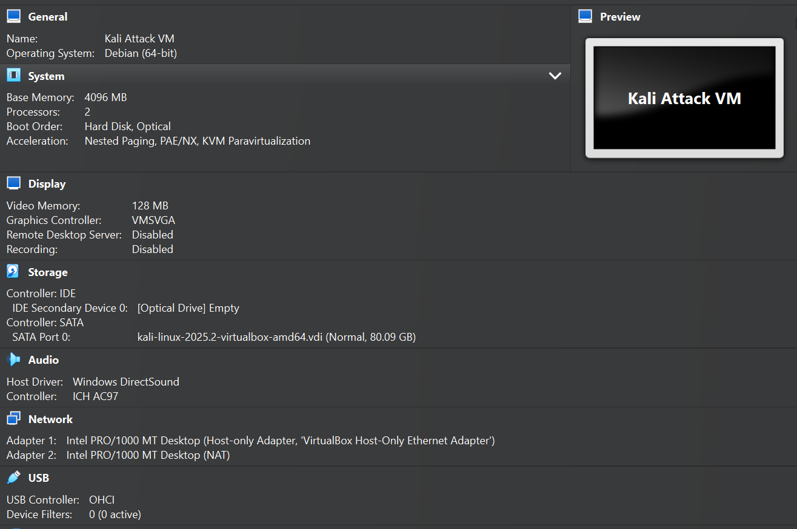  
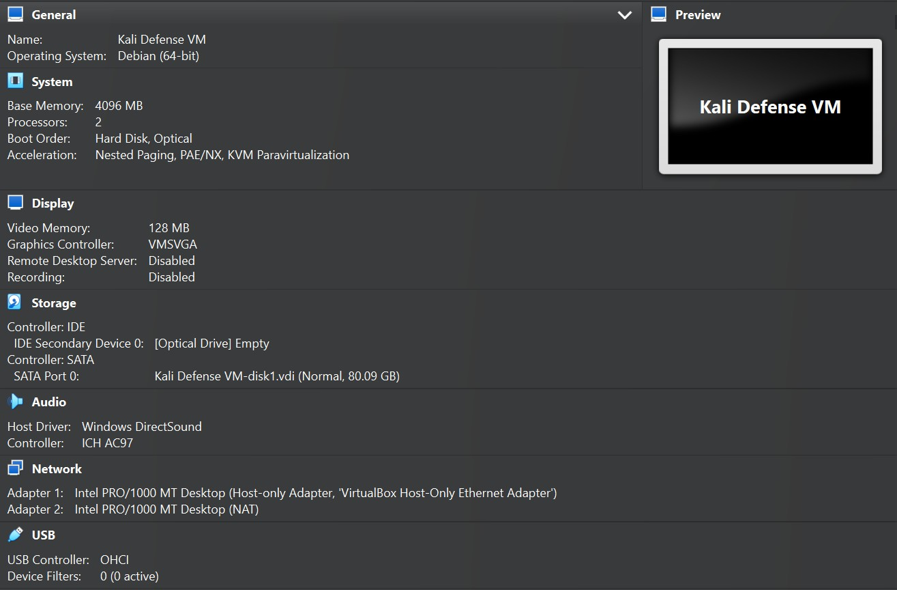  
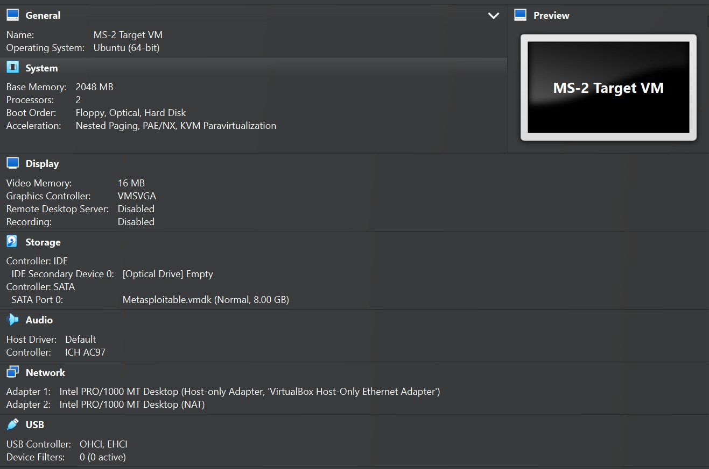  

### **2. VM Login Verification**  
- **Screenshots of successful login for all three VMs**  
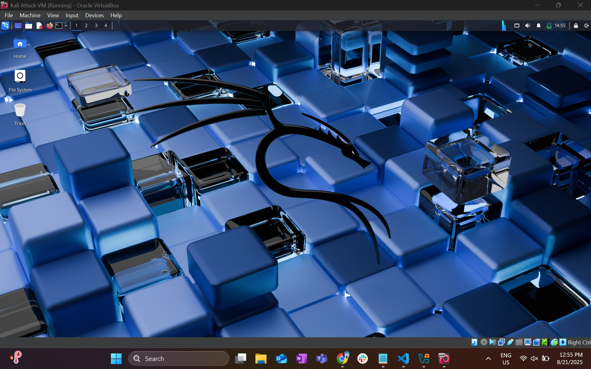

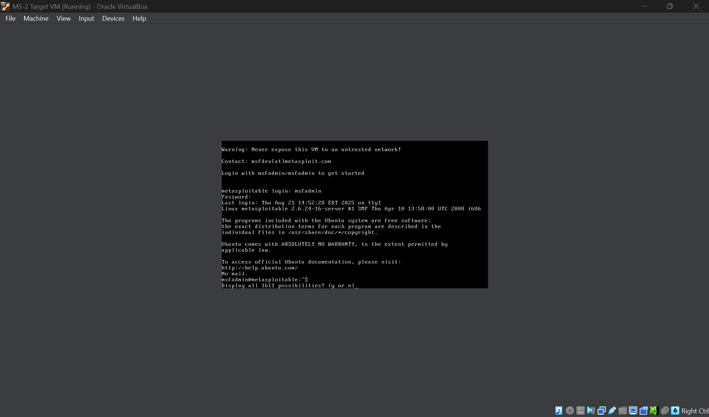

---

## **Task 2: Linux Basics and Network Connectivity**  

### **1. Check System Information**  
- **Screenshot of commands (`uname -a`, `uptime`, `whoami`, `df -h`)**  
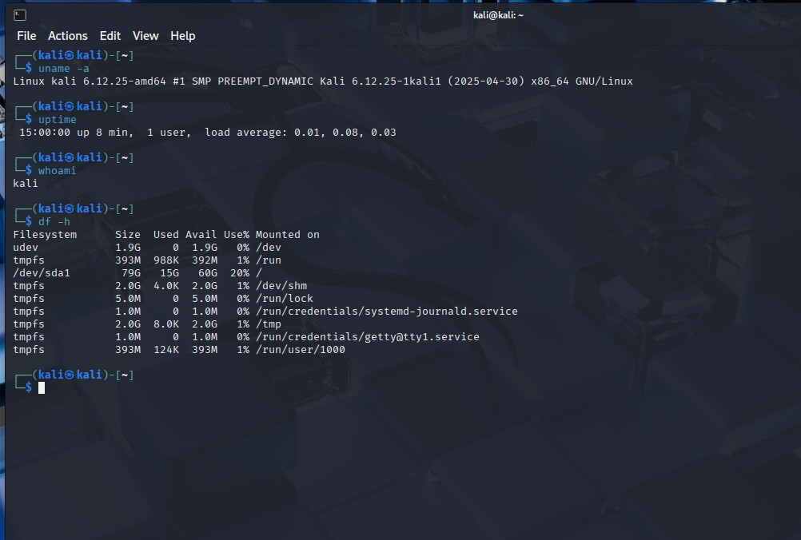
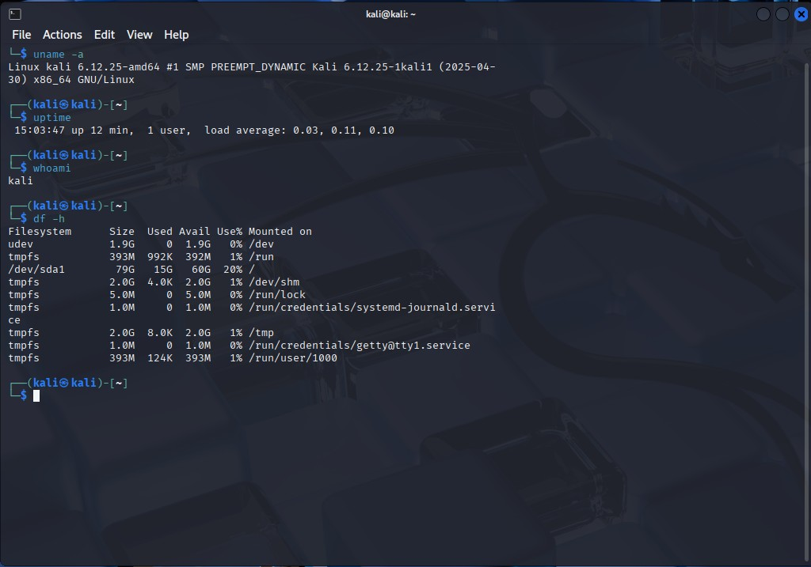

- **Brief Explanation of Outputs**  

  Kali Attack VM
  - The uname -a command shows I’m running on Kali Linux 6.12.25 (x86_64) with a kernel built on April 30, 2025. It indicates that the system is a 64-bit architecture
  - The uptime command shows that the system has been running for 8 minutes. 1 user is logging in , with very low load averages(0.01, 0.08, 0.03), which means the CPU is almost idle and the system is not under stress.
  - The whoami command returns kali, which means the current logged-in user is the standard kali user.
  - The df -h command gives disk usage. The main filesystem is 79 GB total, with 15 GB used and 60 GB available( about 20 percent used). Other entries are temporary filesystems and they are very small and mostly empty. udev is a special virtual filesystem, which is utilizing 1.9 GB.

  Kali Defense VM
  - The uname -a command shows I’m running on Kali Linux 6.12.25 (x86_64) with a kernel built on April 30, 2025. It indicates that the system is a 64-bit architecture
  - The uptime command shows that the system has been running for 12 minutes. 1 user is logged in , with very low load averages(0.03, 0.11, 0.10), which means the CPU is almost idle and the system is not under stress.
  - The whoami command returns kali, which means the current logged-in user is the standard kali user.
  - The df -h command gives disk usage. The main filesystem is 79 GB total, with 15 GB used and 60 GB available( about 20 percent used). Other entries are temporary filesystems and they are very small and mostly empty. udev is a special virtual filesystem, which is utilizing 1.9 GB.

  MS-2 Target VM
  - The uname -a command shows I’m running on Linux Metasploitable, specifically kernel version 2.6.24-16-server compiled on April 10, 2008, for the i686 architecture. It’s a 32 bit build specifically designed for testing vulnerabilities
  - The build date is Thursday Apr 10 13:58:00 UTC 2008, showing that this is an older Linux distribution, often used for security testing/training.
  - The uptime command shows that the system has been running for 12 minutes. 2 users are logged in , with very low load averages(0.08, 0.02, 0.01), which means the CPU is almost idle and the system is not under stress. 
  - The whoami command returns msfadmin, which means the current logged-in user is the standard msfadmin user.
  - The df -h command gives disk usage. The root filesystem (/dev/mapper/metasploitable-root)  has 7 GB capacity, 1.5GB is used and 5.2GB available, and the boot partition is only lightly used.

---

### **2. View Network Configuration**  

- **Screenshot of `ifconfig` or `ip a` and `ip route`**
  - 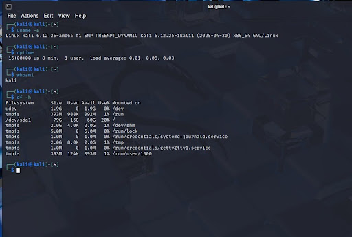
  - 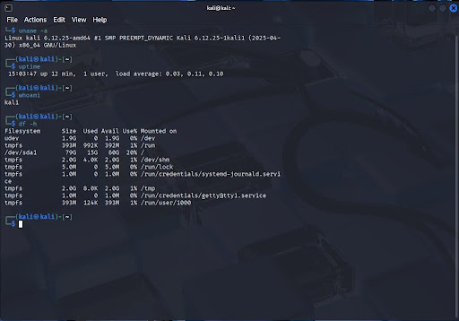
  - 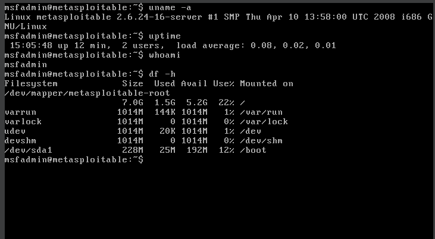

- **Explanation of assigned IP and MAC addresses**  
  - Kali Attack VM: The network interface eth0, which is the host-only adapter, has been assigned the IP address 192.168.56.101(netmask 255.255.255.0) and MAC address 08:00:27:d1:f8:5d. The IP address provides the logical identifier used for routing and communication across networks, while the MAC address is the physical hardware identifier that enables data delivery within the local network segment.
  - Kali Defense VM:The network interface eth0, which is the host-only adapter, has been assigned the IP address 192.168.56.102(netmask 255.255.255.0) and MAC address 08:00:27:05:b6:28. The IP address provides the logical identifier used for routing and communication across networks, while the MAC address is the physical hardware identifier that enables data delivery within the local network segment.
  - MS-2 Target VM:The network interface eth0, which is the host-only adapter, has been assigned the IP address 192.168.56.103(netmask 255.255.255.0) and MAC address 08:00:27:b7:fe:ed. The IP address provides the logical identifier used for routing and communication across networks, while the MAC address is the physical hardware identifier that enables data delivery within the local network segment.
  
- **Does the IP match the expected subnet? Explain why or troubleshoot.** 
  - Kali Attack VM: The assigned IP address falls within the expected testbed subnet of 192.168.56.0/24, confirming that the device is correctly configured for this environment. In this setup, the DHCP server allocates IP addresses in the range of 192.168.x.101 to 192.168.x.254. The IP Address that was assigned- 192.168.56.101 falls in this range. Therefore, the assigned IP is correct. 
  - Kali Defense VM The assigned IP address falls within the expected testbed subnet of 192.168.56.0/24, confirming that the device is correctly configured for this environment. In this setup, the DHCP server allocates IP addresses in the range of 192.168.x.101 to 192.168.x.254. The IP Address that was assigned- 192.168.56.102 falls in this range. Therefore, the assigned IP is correct. 
  - MS-2 Target VM: The assigned IP address falls within the expected testbed subnet of 192.168.56.0/24, confirming that the device is correctly configured for this environment. In this setup, the DHCP server allocates IP addresses in the range of 192.168.x.101 to 192.168.x.254. The IP Address that was assigned- 192.168.56.103 falls in this range. Therefore, the assigned IP is correct. 

---

### **3. Test Connectivity Between VMs**  
- **Screenshot of `ping` results between VMs**
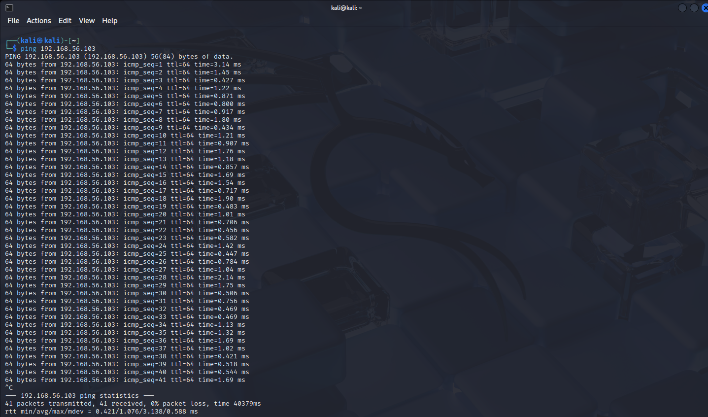  
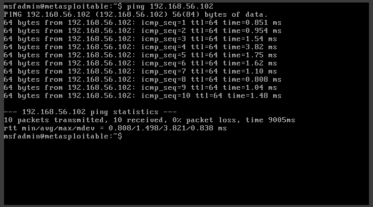        
- **Explanation of success/failure and troubleshooting steps taken**  
  - Both pings were a success. In the images above, each line shows 64 bytes from ... which means the other VM is replying. The icmp_seq increases each time (no gaps or skips). Also, ttl and time=... ms show that the round-trip worked. Finally, the summary also shows 0% packet loss, which means the pings were successful.

---

### **4. Network Scanning with Nmap**  
- **Screenshot of `nmap -p 1-1024 <Metasploitable2-IP>`**
- 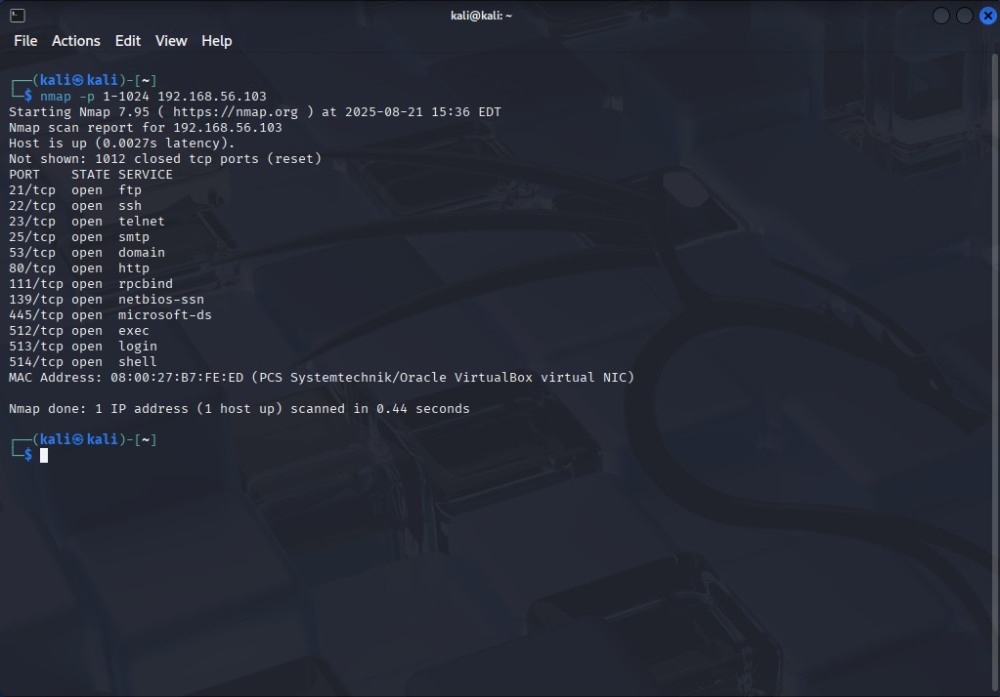   
- **List five open ports and corresponding services**
- 5 open ports: 
  - Port 21- FTP(File Transfer Protocol)
  - Port 22- SSH(Secure Shell)
  - Port 25- SMTP(Secure Mail Transfer Protocol)
  - Port 53-domain
  - Port 80-HTTP(Hyper Text Transfer Protocol)

  
- **Security risks associated with detected ports**  
  - FTP- FTP transmits credentials and data in plaintext, making it vulnerable to eavesdropping and man-in-the-middle attacks.
  - SSH- While generally secure, SSH can be targeted through brute force attacks against weak passwords.
  - SMTP- Often lacks encryption it is vulnerable to email spoofing and relay attacks for spam distribution.
  - Domain- Susceptible to DNS poisoning, zone transfer attacks if misconfigured, amplification attacks for Distributed Denial of Service(DDoS), and information leakage about internal network structure.
  - HTTP-Unencrypted communication allows data interception, vulnerable to various web application attacks (eg.SQL injection), and potential for information disclosure through improper error handling.

---

### **5. Check Running Processes & Active Connections**  
- **Screenshot of `ps aux` and `netstat -tulnp` outputs**
- 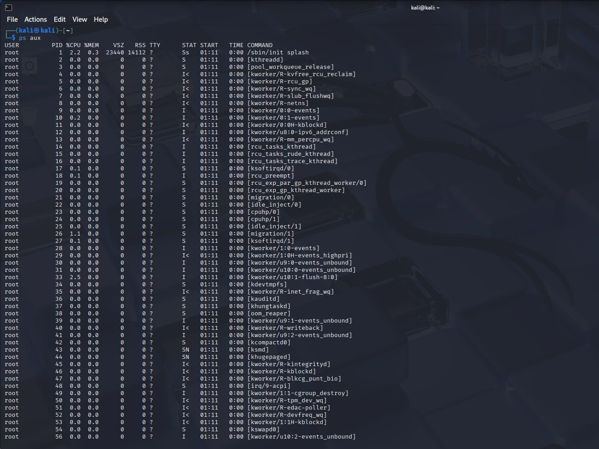    
- 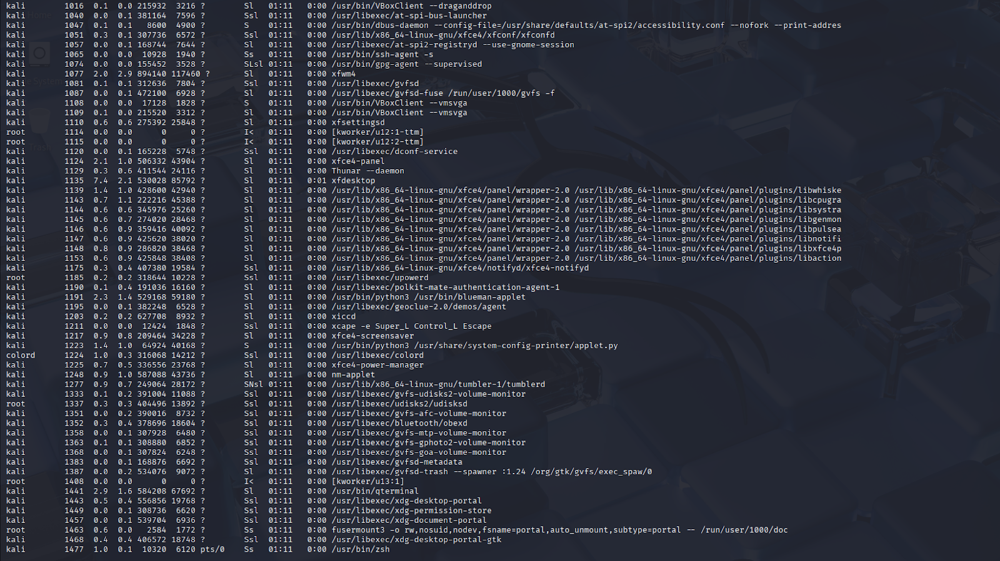
- 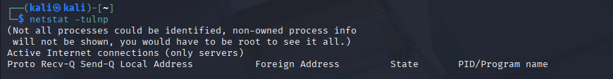    
- 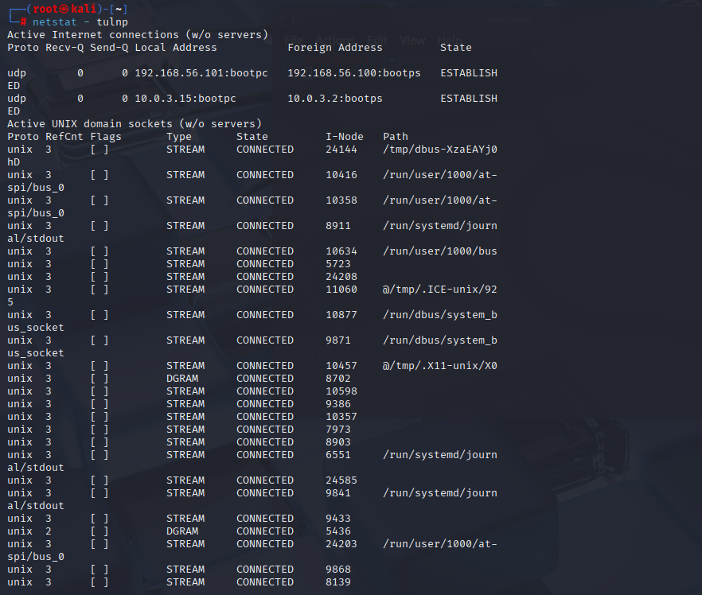    
- 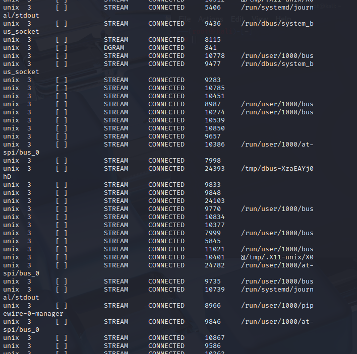    

- **Explanation of any suspicious or unusual findings**  
  - psimon (PID 478, 772)
    - This is unusual. "psimon" is not a standard Linux daemon or package.
  - haveged (PID 461)
    - Used to generate entropy for cryptographic operations. It’s sometimes installed on distros by default, but on Kali, it’s not always preinstalled.
  - ModemManager (PID 663)
    - Normally used for managing 3G/4G USB modems. On a VM/desktop without such hardware, it’s not typically needed. Not malicious by itself, but could be abused as an attack surface.
  - High-resource GUI processes
    - xfdesktop (PID 1135) and xfwm4 (PID 1077) are consuming 7–8% CPU each, which is unusually high for idle desktop processes.

### **6.  Defense VM Promiscuous Mode**
- **Screenshot of VirtualBox network adapter set to “Allow VMs” (Promiscuous Mode)**
- 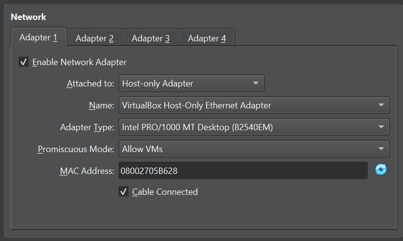
- **Screenshot of terminal showing `PROMISC` enabled for `eth0`**
- 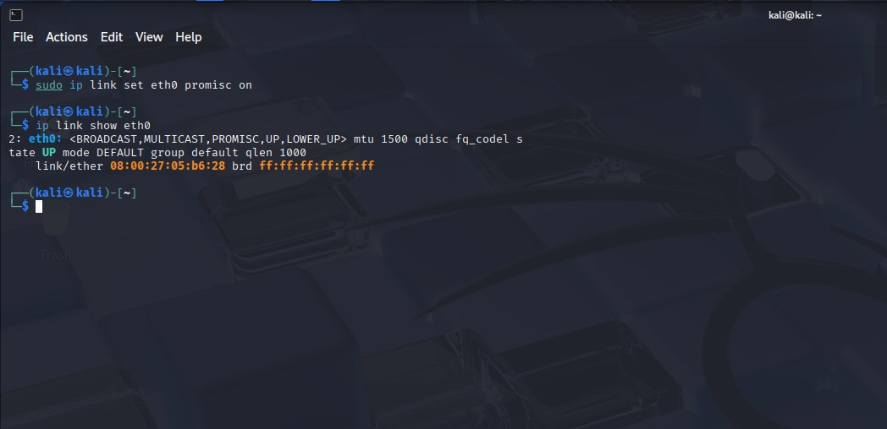

