### **Assignment 2 Report**  
#### CSCI 5743: Cyber and Infrastructure Defense, Fall 2025  

**Name & Student ID**: Yaseer Sabir, 111158157

---

# **Section 1: Conceptual Assignments**  

### **1. ARP Poisoning & Advanced MITM Techniques**  

Attackers who want to bypass static ARP entries or Dynamic ARP Inspection (DAI) take advantage of weak points in how networks handle timing and trust. For example, they can inject spoofed ARP messages during moments when devices refresh their ARP tables, such as DHCP renewals or reboots. Others compromise infrastructure devices like DHCP servers or routers so that poisoned ARP messages appear to come from trusted sources, bypassing normal validation. In environments where DAI is deployed unevenly, attackers can also target areas not covered by inspection. Because of these gaps, defenders are advised to treat unusual ARP activity as a potential indicator of compromise and to enforce consistent switch-level protections across the entire fabric (Cisco Systems, 2024; SentinelOne, 2025).

Proxy ARP manipulation gives attackers even more leverage by allowing them to impersonate routers or gateways. Normally, proxy ARP lets a device answer ARP requests for IP addresses it doesn’t own, which can be useful in certain network setups. When abused, though, an attacker can respond on behalf of multiple devices or even the gateway, pulling traffic through themselves without constantly poisoning individual hosts. This makes attacks blend in with normal routing behavior, creating a stealthier man-in-the-middle position. Networks that don’t need proxy ARP should disable it, and administrators should monitor for devices that suddenly start answering ARP requests for a wide range of IPs (Cisco Systems, 2025; Pynet Labs, 2024).

Even in fully switched networks with VLAN segmentation, ARP-based man-in-the-middle attacks are still possible. The attacker doesn’t need to break switching itself; they just need to exploit design flaws or misconfigurations. For example, a compromised trunk port, an access port assigned to the wrong VLAN, or inconsistencies in VLAN databases across switches can allow an attacker to leak traffic between segments. Alternatively, by compromising any host inside a target VLAN, an attacker can perform local ARP spoofing and combine it with higher-level attacks such as DNS spoofing or SSL stripping. VLANs do reduce exposure, but they don’t replace strong port security, consistent use of DAI and DHCP snooping, and end-to-end encryption of sensitive traffic (Cisco Systems, 2024; NetworkLessons, 2015).

**References**
1) Cisco Systems. (2024, August 5). Troubleshoot Dynamic ARP Inspection (DAI) and IP source guard. Cisco. https://www.cisco.com/c/en/us/support/docs/switches/lan-switch-software/222274-troubleshoot-dynamic-arp-inspection-dai.html

2) Cisco Systems. (2025). Understand proxy ARP. Cisco. https://www.cisco.com/c/en/us/support/docs/ip/dynamic-address-allocation-resolution/13718-5.html

3) NetworkLessons. (2015). ARP poisoning. NetworkLessons. https://networklessons.com/switching/arp-poisoning

4) Pynet Labs. (2024). What is proxy ARP in networking and how it works? Pynet Labs. https://www.pynetlabs.com/what-is-proxy-arp-in-networking/

5) SentinelOne. (2025, May 27). What is ARP spoofing? Risks, detection, and prevention. SentinelOne. https://www.sentinelone.com/cybersecurity-101/threat-intelligence/arp-spoofing/

### **2. ARP Spoofing in IPv6 Networks** 

In IPv4, attackers often perform man-in-the-middle (MITM) attacks using ARP poisoning, where forged ARP replies trick devices into sending traffic through the attacker’s system. IPv6, however, replaces ARP with the Neighbor Discovery Protocol (NDP), which attackers can exploit through NDP spoofing. By sending forged Neighbor Advertisement or Router Advertisement messages, an attacker convinces a host that their machine owns a valid IPv6 address, enabling interception of traffic. Tools such as mitm6 automate this process by advertising a rogue DNS server, capturing authentication traffic, and relaying credentials for privilege escalation (Kraus, n.d.).

Compared to ARP poisoning, NDP spoofing is similar in concept but slightly more complex. ARP poisoning requires only unsolicited ARP replies to overwrite caches, making it straightforward on unprotected IPv4 networks (CrowdStrike, 2022; Imperva, n.d.). NDP spoofing, on the other hand, may involve manipulating multiple IPv6 mechanisms, such as neighbor discovery, router advertisements, and DHCPv6. Despite this added complexity, modern tools make IPv6 MITM attacks practical and highly effective in environments where IPv6 is enabled but unmanaged.

Both attacks are powerful but rely on the absence of authentication and security controls. ARP poisoning remains effective in LANs without ARP inspection or encryption, while IPv6 MITM attacks succeed in networks lacking RA/DHCPv6 filtering or proper IPv6 management. Mitigation strategies include port security and encryption for IPv4, and disabling unused IPv6, filtering rogue advertisements, and strengthening authentication for IPv6 (CrowdStrike, 2022; Imperva, n.d.; Kraus, n.d.).

**References**
1) CrowdStrike. (2022, May 18). Address Resolution Protocol (ARP) spoofing: What it is and how to prevent an ARP attack. CrowdStrike. https://www.crowdstrike.com/en-us/cybersecurity-101/social-engineering/arp-spoofing/

2) Imperva. (n.d.). What is ARP spoofing | ARP cache poisoning attack explained. Imperva. https://www.imperva.com/learn/application-security/arp-spoofing/

3) Kraus, S. (n.d.). Tools of the trade: IPv6 DNS takeover with MitM6. Evolve Security. https://www.evolvesecurity.com/blog-posts/tools-of-the-trade-ipv6-dns-takeover-with-mitm6

### **3. DHCP Starvation & Rogue DHCP for Long-Term Persistence**  

DHCP Starvation is an effective denial-of-service (DoS) technique because it depletes the pool of available IP addresses on a legitimate DHCP server. Attackers generate a flood of DHCP discovery requests, often spoofing unique MAC addresses, until the server cannot assign new leases. This leaves legitimate clients unable to obtain an IP address, effectively denying them access to network resources (MITRE ATT&CK®, 2025).

Beyond DoS, adversaries can deploy a rogue DHCP server to achieve man-in-the-middle (MITM) attacks and long-term persistence. A rogue server can hand out malicious configuration parameters such as default gateways, DNS servers, and proxy settings. By providing long lease times, the attacker ensures that the victim device continues to use attacker-controlled settings across reboots. This allows ongoing credential theft, traffic interception, and redirection of software updates or authentication attempts to attacker infrastructure. Such persistence blends with normal traffic, making detection difficult (MITRE ATT&CK®, 2025).

A defense-in-depth strategy is crucial for mitigating these threats. DHCP snooping allows network switches to classify ports as trusted or untrusted, dropping DHCP replies from unauthorized ports and building a binding table for downstream protections. 802.1X authentication enforces device or user authentication before granting network access, preventing rogue devices from offering DHCP responses. Finally, VLAN segmentation restricts traffic so only trusted DHCP servers can communicate with clients, while isolating guest or untrusted devices to limited broadcast domains (Cisco Community, 2018). When layered together, these controls significantly reduce the chances of both DHCP exhaustion and long-term persistence through rogue servers.

**References (APA)**
1) Cisco Community. (2018, August 4). Preventing/Eliminating Rogue DHCP Server [Online forum thread]. Cisco. https://community.cisco.com/t5/switching/preventing-eliminating-rogue-dhcp-server/td-p/1363274

2) Cisco Systems. (n.d.). Operate and troubleshoot DHCP snooping on Catalyst switches. Cisco. https://www.cisco.com/c/en/us/support/docs/ip/dynamic-host-configuration-protocol-dhcp-dhcpv6/217055-operate-and-troubleshoot-dhcp-snooping.html

3) MITRE ATT&CK®. (2025, April 15). Adversary-in-the-middle: DHCP spoofing (T1557.003). The MITRE Corporation. https://attack.mitre.org/techniques/T1557/003/

### **4. VLAN Hopping & Subverting Network Segmentation**  

Beyond double tagging and switch spoofing, attackers can also exploit other weaknesses. For example, native VLAN misuse occurs when trunk ports use default native VLANs, allowing untagged traffic to traverse segmentation boundaries (Imperva, n.d.). CAM table exhaustion is another technique in which the attacker floods the switch’s MAC table and forces it to broadcast frames to all ports, exposing data if trunk links or misconfigurations exist (Senecal, n.d.). Misconfigured router-on-a-stick setups or ACLs can also allow unauthorized inter-VLAN routing (TechTarget, 2021). Similarly, PVLAN misconfigurations may undermine isolation and enable unintended host-to-host communication (Twingate, 2024).

Insider threat abuse. Insiders with legitimate access pose unique risks. For example, a technician could attach a rogue switch to an access port and enable trunking if Dynamic Trunking Protocol (DTP) is left active. This action could expose multiple VLANs to unauthorized devices (Twingate, 2024). Poor configuration management and lack of audits amplify this type of escalation.

Dynamic VLAN assignment via RADIUS exploitation. Dynamic VLANs are often assigned through RADIUS following 802.1X authentication. If attackers exploit weak authentication methods (e.g., PEAP/MSCHAPv2 without certificate validation) or compromise RADIUS secrets, they can spoof responses to gain unauthorized VLAN membership (Goldberg, 2024). This attack undermines the reliability of network segmentation.

Defensive strategies. Mitigation involves disabling DTP, explicitly tagging all VLAN traffic, auditing ACLs and PVLANs, and hardening RADIUS by adopting TLS (RADSEC) and certificate-based EAP methods. Continuous monitoring of switch configurations and authentication logs adds further protection.

**References (APA)**
1) Goldberg, S. (2024, August). RADIUS/UDP considered harmful [Conference presentation]. USENIX Security Symposium. https://www.usenix.org/conference/usenixsecurity24/presentation/goldberg

2) Imperva. (n.d.). What is VLAN hopping | Risks, attacks & prevention. Imperva. https://www.imperva.com/learn/availability/vlan-hopping/

3) Senecal, L. (n.d.). Layer 2 attacks and their mitigation [Cisco Security Bootcamp]. Cisco Systems. https://www.cisco.com/c/dam/global/fr_ca/training-events/pdfs/L2-security-Bootcamp-final.pdf

4) TechTarget. (2021, April). What is VLAN hopping and how does it work? TechTarget. https://www.techtarget.com/searchsecurity/definition/VLAN-hopping

5) Twingate. (2024, August 1). What is VLAN hopping? Twingate Blog. https://www.twingate.com/blog/vlan-hopping

### **5. Wireless Attacks: Rogue AP vs. Evil Twin**  
Wireless Attacks: Rogue AP vs. Evil Twin
MAC filtering and SSID hiding offer almost no real protection against a determined attacker: MAC addresses are transmitted in the clear and can be observed with off-the-shelf tools (e.g., airodump-ng) and then spoofed, and a hidden SSID simply reduces casual discovery—clients and APs still reveal the network name during normal operations, so sniffing recovers it quickly. An attacker can therefore bypass these controls to join or impersonate a network (Smallstep, 2024; Medium, 2023).

A practical escalation path begins with passive eavesdropping or targeted deauthentication frames to force clients off a legitimate AP; the attacker then raises a rogue AP (an “evil twin”) with the same SSID and stronger signal or captive-portal lure. Once clients roam or reconnect to the rogue AP, the attacker can intercept credentials, hijack sessions, or perform SSL stripping/mitm (Kaspersky, n.d.; Varonis, 2021). Deauthentication is trivial because 802.11 management frames are often unauthenticated. Detection/mitigation therefore requires management-frame protection (802.11w/Protected Management Frames), monitoring for suspicious APs, and client-side certificate/portal verification.

WPA3’s SAE (Dragonfly) replaces password-based 4-way handshakes with a PAKE that resists offline dictionary attacks and provides forward secrecy; however, early analyses (Dragonblood) showed downgrade, side-channel timing, and implementation flaws that allowed online or side-channel exploitation in some deployments—so correct, patched implementations plus transition-mode hardening are essential (Vanhoef & Ronen, 2019).

References (APA 7)

1) Kaspersky. (n.d.). Evil twin attacks and how to prevent them. https://usa.kaspersky.com/resource-center/preemptive-safety/evil-twin-attacks

2) Smallstep. (2024, September 24). MAC address filtering and hiding SSID won't protect your network. https://smallstep.com/blog/mac-address-filtering-and-hiding-ssid-dont-work/

3) Vanhoef, M., & Ronen, E. (2019). Dragonblood: Attacking the Dragonfly handshake of WPA3 (Black Hat / WAC slides & paper). https://i.blackhat.com/USA-19/Wednesday/us-19-Vanhoef-Dragonblood-Attacking-The-Dragonfly-Handshake-Of-WPA3-wp.pdf

4) Varonis. (2021). Evil twin attack: What it is, how to detect & prevent it. https://www.varonis.com/blog/evil-twin-attack

5) Zanna, P. (2022). Preventing attacks on wireless networks using SDN (article). PMC. https://www.ncbi.nlm.nih.gov/pmc/articles/PMC9738866/

6) Medium. (2023, Nov.). Spoof, bypass, and breach: Bypassing MAC filtering. https://medium.com/@above_the_firewall/spoof-bypass-and-breach-bypassing-mac-filtering-62117103ec8a

### **6. IP Spoofing in Multi-Stage Attacks**  
How IP spoofing facilitates session hijacking
IP spoofing enables an attacker to impersonate a trusted host by forging the source address of packets. In UDP sessions, where there is no handshake or session state, spoofing allows attackers to inject malicious responses (e.g., fake DNS replies) directly into the victim’s flow (Wang et al., 2007). In multi-stage attacks, spoofing is often combined with sniffing or man-in-the-middle positioning to desynchronize sessions and insert malicious data.

UDP vs. TCP effectiveness
Spoofing is more effective against UDP because it is connectionless, lacking sequence numbers and acknowledgments. An attacker only needs to match the correct 5-tuple (source IP, destination IP, source port, destination port, protocol). TCP, by contrast, relies on a three-way handshake and sequence numbers, so blind injection requires guessing these values (Allman, 1999).

Full TCP hijacking despite sequence randomization
Although modern TCP stacks randomize initial sequence numbers (ISNs), attackers with sniffing capability can still observe the correct sequence numbers. Moreover, off-path attacks have leveraged side channels (e.g., IPID counters or packet timing) to infer ISNs (Qian et al., 2012). Thus, full TCP hijacking is still possible when attackers can sniff or exploit side channels, despite improvements in sequence number entropy.

**References (APA)**

1) Allman, M. (1999). A web server’s view of the transport layer. ACM SIGCOMM Computer Communication Review, 29(5), 10–20. https://doi.org/10.1145/505696.505699

2) Qian, Z., Mao, Z. M., & Xie, Y. (2012). Off-path TCP sequence number inference attack. IEEE Symposium on Security and Privacy, 347–361. https://doi.org/10.1109/SP.2012.28

3) Wang, X., Zhang, M., & Shin, K. G. (2007). Detecting SYN flooding attacks. IEEE INFOCOM 2007, 1–13. https://doi.org/10.1109/INFCOM.2007.189

### **7. DNS Cache Poisoning: Evolution of Attacks**  
Pre-Kaminsky vs. Kaminsky attacks. Pre-Kaminsky DNS poisoning relied on predictable transaction IDs: attackers flooded a resolver with forged replies hoping to guess the 16-bit ID. Success rates were very low because only one guess per query was possible (Liu, 2004). Kaminsky’s 2008 attack changed the landscape by forcing resolvers to repeatedly query random subdomains, creating multiple simultaneous opportunities to guess the correct transaction ID, which drastically improved success rates (Kaminsky, 2008).

Mitigations: randomized IDs and ports. In response, resolvers introduced randomized query IDs combined with source port randomization. This increased entropy from 16 bits to roughly 32 bits, making brute-force guessing far less practical (Bernstein, 2008).

DNSSEC adoption challenges. DNSSEC addresses the integrity problem directly by cryptographically signing DNS records. However, adoption remains limited due to operational complexity, key rollover and trust chain management, and issues with packet fragmentation caused by larger DNSSEC responses (ICANN, 2019).

Bypassing DNSSEC. Attackers can bypass DNSSEC protections by directly compromising resolvers, exploiting misconfigured authoritative servers, or taking advantage when validation is disabled to improve performance. In such cases, forged records may still be served as “authentic,” undermining DNSSEC’s protections (Herzberg & Shulman, 2013).

**References (APA 7th Edition)**

1) Bernstein, D. J. (2008). DNS cache poisoning: The next generation. University of Illinois Chicago. https://cr.yp.to/djbdns/forgery.html

2) Herzberg, A., & Shulman, H. (2013). Fragmentation considered poisonous: Or one-domain-to-rule-them-all.org. 2013 IEEE Symposium on Security and Privacy, 703–717. https://doi.org/10.1109/SP.2013.56

3) ICANN. (2019). DNSSEC deployment report. Internet Corporation for Assigned Names and Numbers. https://www.icann.org/resources/pages/dnssec-deployment-2019-04-01-en

4) Kaminsky, D. (2008). It’s the end of the cache as we know it [Conference presentation]. Black Hat USA. https://www.blackhat.com/presentations/bh-usa-08/Kaminsky/BH_US_08_Kaminsky_DNS.pdf

5) Liu, C. (2004). DNS and BIND security issues. O’Reilly Media. https://www.oreilly.com/library/view/dns-and-bind/0596004109/ch14.html

### **8. BGP Hijacking: Attackers as Network Operators**  
BGP was designed in an era of implicit trust and lacks built-in authentication of route announcements. Any autonomous system (AS) can announce IP prefixes, and peers may propagate them without verifying origin legitimacy (Butler, Farley, McDaniel, & Rexford, 2010).

Route leaks vs. hijacks. A route hijack occurs when an AS falsely originates a prefix it does not own, impersonating another network. In contrast, a route leak happens when an AS incorrectly propagates routes it has learned, often violating routing policies such as customer-to-provider constraints. While hijacks are typically intentional, leaks may result from accidents or malicious misconfigurations.

Nation-state exploitation. Nation-states can manipulate BGP to redirect or blackhole traffic, enabling surveillance, censorship, or traffic manipulation across borders. By leveraging upstream ISPs, they can re-route international traffic for intelligence purposes (Sermpezis, Kotronis, Dimitropoulos, & Dainotti, 2018).

Amazon Route 53 hijack (2018). In 2018, attackers hijacked prefixes belonging to Amazon Route 53, redirecting cryptocurrency wallet traffic to malicious servers. Effective defenses that could have prevented this include:

RPKI (Resource Public Key Infrastructure): cryptographically validates prefix origins.

Route filtering and prefix limits: ISPs enforce strict routing policies.

BGP monitoring and anomaly detection: alerts on sudden or suspicious path changes (Internet Society, 2018).

**References (APA 7th Edition)**

1) Butler, K., Farley, T. R., McDaniel, P., & Rexford, J. (2010). A survey of BGP security issues and solutions. Proceedings of the IEEE, 98(1), 100–122. https://doi.org/10.1109/JPROC.2009.2034031

2) Internet Society. (2018, April 27). What happened? The Amazon Route 53 BGP hijack to take over Ethereum cryptocurrency wallets. https://www.internetsociety.org/blog/2018/04/amazons-route-53-bgp-hijack/

3) Sermpezis, P., Kotronis, V., Dimitropoulos, X., & Dainotti, A. (2018). A survey among network operators on BGP prefix hijacking. ACM SIGCOMM Computer Communication Review, 48(1), 64–69. https://dl.acm.org/doi/10.1145/3211852.3211862

### **9. Amplification DDoS Attacks: DNS vs. NTP vs. Memcached**  
DNS and NTP reflection attacks exploit UDP responses that are larger than their queries, typically achieving amplification factors of 30–60×. Memcached, however, can return multi-megabyte responses to very small forged requests, yielding amplification factors exceeding 50,000×, making it one of the most destructive amplification vectors identified (Rossow, 2014).

TCP-based amplification. Even when UDP traffic is filtered, attackers can abuse TCP protocols. For example, HTTP reflection attacks may leverage misconfigured web servers, while TCP SYN floods with spoofed ACKs can exhaust server state tables. Application-layer protocols, such as databases responding with large payloads over TCP, may also be abused if servers are left exposed without authentication (Antonakakis et al., 2017).

BGP spoofing and global scale. Attackers may also combine reflection/amplification with BGP route manipulation. By distributing spoofed traffic across multiple ingress points, they can bypass anti-spoofing measures such as BCP 38. This enables reflection and amplification attacks to operate at global scale, complicating detection and mitigation. Recent research shows how adversaries can even use BGP-based techniques to actively trace or steer amplified traffic flows for greater effect (Krupp & Rossow, 2021; McDaniel, Smith, & Schuchard, 2019).

**References (APA)**

1) Antonakakis, M., April, T., Bailey, M., Bernhard, M., Bursztein, E., Cochran, J., Durumeric, Z., Halderman, J. A., Menscher, D., Seaman, C., Sullivan, N., Thomas, K., & Zhou, Y. (2017). Understanding the Mirai botnet. In Proceedings of the 26th USENIX Security Symposium (pp. 1093–1110). USENIX Association. https://www.usenix.org/conference/usenixsecurity17/technical-sessions/presentation/antonakakis

2) Krupp, J., & Rossow, C. (2021). BGPeek-a-Boo: Active BGP-based traceback for amplification DDoS attacks. arXiv. https://arxiv.org/abs/2103.08440

3) McDaniel, T., Smith, J. M., & Schuchard, M. (2019). The Maestro attack: Orchestrating malicious flows with BGP. arXiv. https://arxiv.org/abs/1905.07673

4) Rossow, C. (2014). Amplification hell: Revisiting network protocols for DDoS abuse. In Proceedings of the 21st Annual Network and Distributed System Security Symposium (NDSS 2014). Internet Society. https://doi.org/10.14722/ndss.2014.23233

### **10. DDoS Mitigation: Proactive vs. Reactive Defense**  
Cloud-hosted services face increasingly sophisticated distributed denial-of-service (DDoS) attacks that combine volumetric floods, protocol exploitation, and application-layer abuse. Reactive defenses alone (e.g., firewall rules) are insufficient; instead, a layered proactive approach is essential (Osanaiye, Choo, Dehghantanha, Xu, & Dlodlo, 2017).

Effective defense combinations.

- Anycast routing distributes traffic across global nodes, absorbing floods.

- Rate limiting and filtering blocks basic reflection/amplification at the edge.

- Behavioral analysis and anomaly detection detects subtle application-layer abuses in real time.

- Scrubbing centers like CDNs offload malicious traffic before it reaches core infrastructure.

Zero-trust networking redefines defense by requiring authentication and continuous verification at every stage. Applied to DDoS, zero-trust restricts exposure by minimizing public-facing endpoints, segmenting applications, and ensuring that only authenticated traffic reaches critical services (Rose, Borchert, Mitchell, & Connelly, 2020). This reduces the attack surface and shifts defenses from perimeter-only models to identity- and policy-driven enforcement.

**References (APA)**

1) Osanaiye, O., Choo, K.-K. R., Dehghantanha, A., Xu, Z., & Dlodlo, M. (2017). DDoS attacks in cloud computing: A survey. Computer Communications, 107, 30–48. https://doi.org/10.1016/j.comcom.2017.03.010

2) Rose, S., Borchert, O., Mitchell, S., & Connelly, S. (2020). Zero trust architecture (NIST Special Publication 800-207). National Institute of Standards and Technology. https://doi.org/10.6028/NIST.SP.800-207

### **11. Emerging Cyber Threats in Cloud & AI-Driven Networks**  
As organizations adopt cloud-native, AI-driven, and edge computing architectures, attackers gain new opportunities. Serverless computing introduces ephemeral functions that often bypass traditional monitoring and protection mechanisms, opening risks like event-data injection, runtime isolation escapes, or abuse of misconfigured permissions (Marin, Perino, & Di Pietro, 2022). AI-driven automation further introduces adversarial machine learning threats, whereby attackers subtly manipulate input data or poisoning the training pipeline to force incorrect decisions or subvert automation (Papernot, McDaniel, Sinha, & Wellman, 2018). Supply chain vulnerabilities become more serious in cloud ecosystems: compromised libraries, container images, or CI/CD pipelines can propagate across tenants. Edge computing adds yet another layer of exposure, as distributed nodes often have weaker physical and logical defenses.

Perimeter-based defenses struggle in this context. Serverless functions may execute across many boundaries, making network-based firewalling ineffective. AI-manipulated inputs may evade static signatures. Supply chain attacks bypass traditional network defenses entirely, requiring provenance and integrity validation.

Enterprises must shift strategy: adopt zero trust (never trust, always verify), enforce workload identity, instrument runtime monitoring and observability for ephemeral functions, incorporate defenses against adversarial ML (e.g. input sanitization, anomaly detection), and strengthen software supply chain security through signed images, SBOMs, and continuous validation.

**References (APA)**

1) Marin, E., Perino, D., & Di Pietro, R. (2022). Serverless computing: a security perspective. Journal of Cloud Computing, 11, Article 69. https://journalofcloudcomputing.springeropen.com/articles/10.1186/s13677-022-00347-w
 
2) Papernot, N., McDaniel, P., Sinha, A., & Wellman, M. (2018). Towards the science of security and privacy in machine learning. IEEE European Symposium on Security and Privacy. https://arxiv.org/abs/1611.03814

### **12. Shaping Your Security Mindset**  
Studying LAN and WAN attacks highlights that security is no longer about firewalls alone but about layered defense. LAN-level threats (e.g., ARP spoofing, VLAN hopping) reveal how misconfigurations undermine segmentation. WAN-level attacks (e.g., BGP hijacks, DDoS) show that even the internet’s backbone lacks built-in trust.

Critical overlooked measures. I now see first-hop security (DHCP snooping, ARP inspection), DNSSEC/DNS monitoring, and BGP route validation (RPKI) as essential, where previously I might have assumed perimeter firewalls were sufficient.

LAN vs. WAN priority. If forced to choose, I would prioritize internal LAN defenses. Perimeter WAN security is vital, but many real-world breaches (e.g., insider threats, lateral movement in ransomware) succeed because once attackers get in, segmentation and internal controls fail. A hardened LAN limits blast radius, while WAN defenses can often be augmented with cloud/CDN partners.

**References (APA)**

1) Rose, S., Borchert, O., Mitchell, S., & Connelly, S. (2020). Zero trust architecture (NIST Special Publication 800-207). National Institute of Standards and Technology. https://doi.org/10.6028/NIST.SP.800-207

2) Sermpezis, P., Kotronis, V., Dimitropoulos, X., & Dainotti, A. (2018). A survey among network operators on BGP prefix hijacking. ACM SIGCOMM Computer Communication Review, 48(1), 64–69. https://doi.org/10.1145/3211852.3211859

### **13. Designing a Secure Network: VLAN Segmentation & Access Control**  
Designing segmentation
I would design VLANs aligned with business functions: IT, HR, Finance, and guest/IoT each in separate VLANs with ACLs enforcing least-privilege communication. Sensitive VLANs like the Finance department would only route through firewalled inter-VLAN gateways with strict monitoring. Management VLANs would be fully isolated with jump-host access only.

Over-segmentation risks operational inefficiency to occur. For example, Human Resources may need controlled access to Finance data. Instead of proliferating VLANs, I would combine VLANs with micro-segmentation (host-based firewalls, identity-aware proxies) to strike a balance between security and manageability (Cisco Systems, n.d.).

There are some common misconfigurations and mitigation techniques:-
1) Leaving default/native VLANs untagged → attackers exploit VLAN hopping. Mitigation: always tag native VLAN and disable unused ports.
2) Enabling DTP (dynamic trunking) on access ports → rogue switches can form trunks. Mitigation: disable DTP and lock ports to access mode.
3) Weak ACLs between sensitive VLANs → insider pivoting. Mitigation: enforce least privilege and continuously audit ACLs.

**References (APA)**

Cisco Systems. (n.d.). Cisco campus LAN and WLAN design guide. Cisco. Retrieved from https://www.cisco.com/c/en/us/td/docs/solutions/CVD/Campus/cisco-campus-lan-wlan-design-guide.html

### **14. Protecting Against DDoS & Global Threats**  
Immediate response steps
If hit by a large-scale DDoS, my first steps would be to identify attack type (volumetric, protocol, or application), rate-limit ingress traffic, engage upstream ISPs or cloud scrubbing providers, and reroute traffic via Anycast/CDN nodes to distribute load. Communication with stakeholders is also critical.

The following are a couple of long term defenses:-
1) Volumetric mitigation. Massive floods are best handled before they reach the target. Anycast routing spreads load across multiple sites, elastic cloud scaling provides temporary capacity to absorb spikes, and upstream filtering by ISPs or CDNs blocks obvious malicious traffic closer to its source.

2) Protocol-layer defense. Many DDoS vectors exploit misconfigured services like NTP or Memcached. Long-term defense means patching services, disabling unused features, and rate-limiting responses to prevent amplification. Regular audits ensure that no exposed system can be abused as a reflector.

3) Application defense. Layer 7 attacks often mimic normal user behavior. Behavioral WAFs, CAPTCHAs, and anomaly detection help distinguish bots from real users. These tools must be tuned continuously so defenses evolve with attacker techniques.

4) Resilience planning. Technical defenses are only part of the solution. Clear runbooks, regular response drills, and partnerships with cloud scrubbing providers build organizational readiness, ensuring services can recover quickly even if an attack succeeds in disruption.

Cloud-based mitigation, which companies like Akamai and Cloudflare handle is ideal for volumetric floods since they absorb massive bandwidth. On-premise defenses (rate limiting, firewalls, IDS) remain essential for low-latency local filtering and preventing insider DDoS from within the LAN. A hybrid approach balances global scale with local precision (Kumar et al., 2020).

**References (APA)**

Kumar, A., et al. (2020). Survey of DDoS mitigation techniques in cloud computing. Journal of Cloud Computing, 9(1), 1–20. https://doi.org/10.1186/s13677-020-00195-5

### **15. LAN Security: Preventing Internal Threats & Lateral Movement**  
Once a foothold is gained, time is critical. Network monitoring for unusual ARP/DHCP patterns, east–west traffic, and anomalous authentication can reveal lateral movement attempts (Bhuyan, Bhattacharyya, & Kalita, 2014). Endpoint detection and response (EDR) integrated with a SIEM helps correlate events for fast containment.

Here are some preventive controls
1) Port security: limit the number of MAC addresses per port to prevent rogue switches like Cisco LAN security features include port-security

2) ARP and DHCP defenses: deploy Dynamic ARP Inspection (DAI) and DHCP snooping to stop spoofing and DHCP starvation attacks.

3) Authentication: enforce 802.1X for device-level identity before granting VLAN access. Together, these controls shrink the attack surface against insiders and rogue devices (Cisco, n.d.).

Misconfigurations often outweigh technical exploits. To address this, enforce security-as-code (infrastructure as code under version control), apply automated configuration compliance checks, and conduct ongoing training for IT teams. Regular internal audits ensure policies are followed, and staff understand the risks of misconfiguration.

**References (APA)**

1) Bhuyan, M. H., Bhattacharyya, D. K., & Kalita, J. K. (2014). Network anomaly detection: Methods, systems and tools. IEEE Communications Surveys & Tutorials, 16(1), 303–336. https://doi.org/10.1109/SURV.2013.052213.00046

2) Cisco Systems. (n.d.). Campus LAN and wireless LAN solution design guide: Design fundamentals—LAN security best practices. Retrieved from https://www.cisco.com/c/en/us/td/docs/solutions/CVD/Campus/cisco-campus-lan-wlan-design-guide.html

---

# **Section 2: Hands-on Network Attacks**  

---

## **Attack 1: ARP Spoofing (Local MITM – Simplified Version)**  

### **Deliverables**  

#### **Screenshots**  
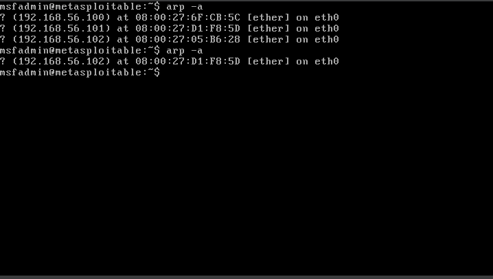

#### **Response to Analysis Questions**    

ARP poisoning lets an attacker send forged ARP messages onto a local Ethernet network so that other hosts associate the attacker’s MAC address with the IP address of a legitimate device. Once poisoned, the attacker can intercept, monitor, modify, or drop traffic between victims and the real host. This enables man-in-the-middle eavesdropping, session hijacking, credential theft, and selective or complete denial of service. Because ARP is stateless and lacks authentication, these attacks are simple to perform on flat networks.

Preventing ARP poisoning requires layered defenses. At the network level, enable switch features such as DHCP snooping and Dynamic ARP Inspection (DAI) so switches will drop ARP replies that don’t match trusted DHCP/ARP bindings. Use port security and 802.1X access control to limit which devices can attach to ports. For critical hosts, configure static ARP entries to eliminate reliance on learning. Monitor for anomalies with tools like arpwatch, IDS/IPS rules, and network flow analysis to detect unexpected ARP changes. At the transport/application level, always use end-to-end encryption like TLS/HTTPS, VPNs so intercepted packets are unusable to attackers. Regular network segmentation like through VLANs and least-privilege access also reduce exposure. Combining host and switch-level controls with encryption and monitoring gives the best protection against ARP poisoning.

---

## **Attack 2: SYN Flood (With and Without IP Spoofing)**  

### **Deliverables**  

#### **Screenshots**  
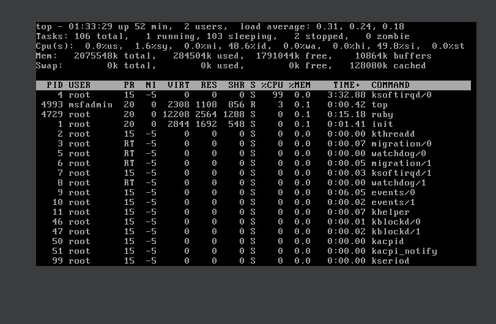
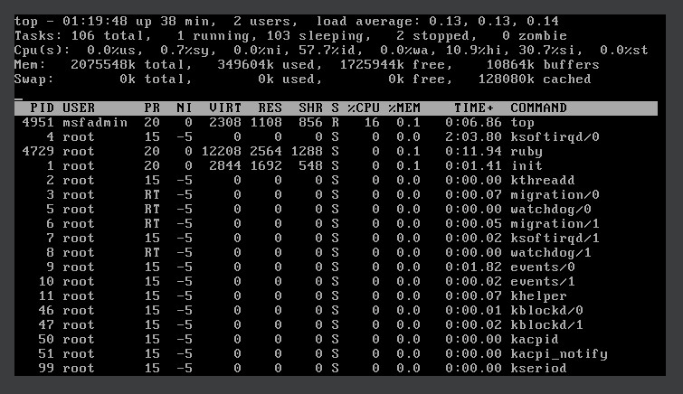
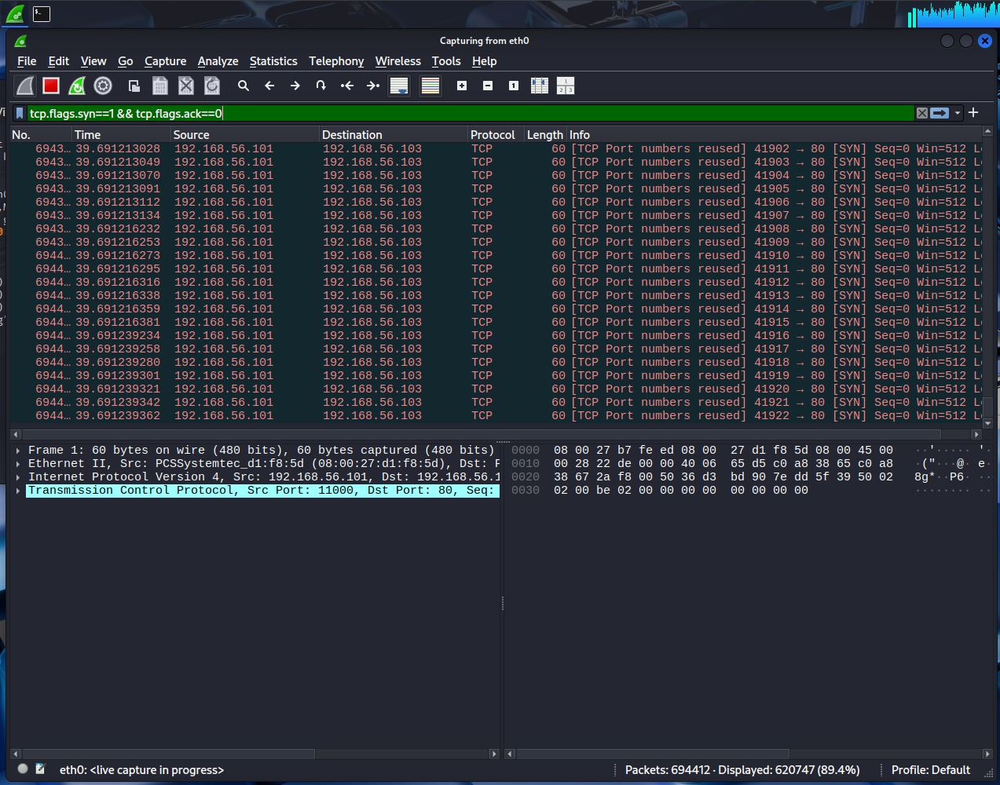
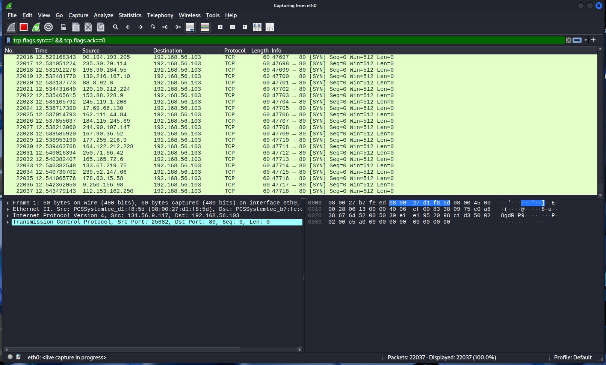

#### **Response to Analysis Questions**     

1) How does the attack pattern differ in Wireshark?
In Wireshark, I noticed the non-spoofed attack show thousands of SYN Packers coming from a single source, in this case 192.168.56.101. They were coming on the same port 80 and they were very little time between each successive attack. In the spoofed attack, Wireshark was displaying SYN packets appearing to come from hundreds or thousands of different IPs from very diverse ranges. There was no specific pattern that I found. In this attack also, their was very little time between each successive attack. 

2) Why is IP spoofing effective for hiding attackers and bypassing defenses?
IP spoofing is effective for hiding attackers and bypassing defenses because victims like here, MS-2, cannot find out who the real attacker is. It's much harder now to find the source of the actual attacker, and thus one IP can't specifically be blocked and blacklisted. 

3) Which version of the attack would be harder to block with traditional firewalls?
The spoofed attack would be harder to block with traditional firewalls. This is because spoofed attack would require thousands of individual blocking rules like "deny host 192.168.56.105" and so on. This is impractical because of firewall rule capacity limits and since they are inherently designed for single-IP blocking. This makes the distributed spoofed attack really challenging to mitigate with traditional firewalls.

---

## **Attack 3: Exploiting a Vulnerable Service (Remote Code Execution – RCE)**  

### **Deliverables**  

#### **Screenshots**  
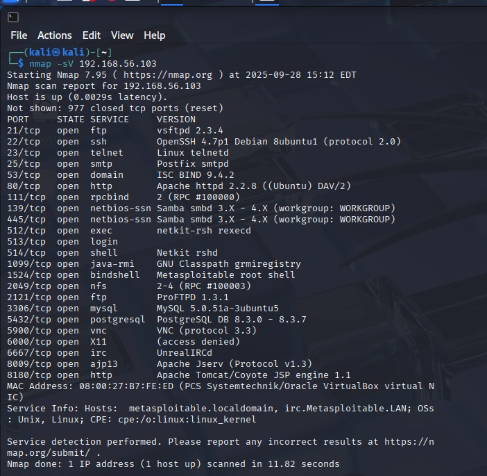
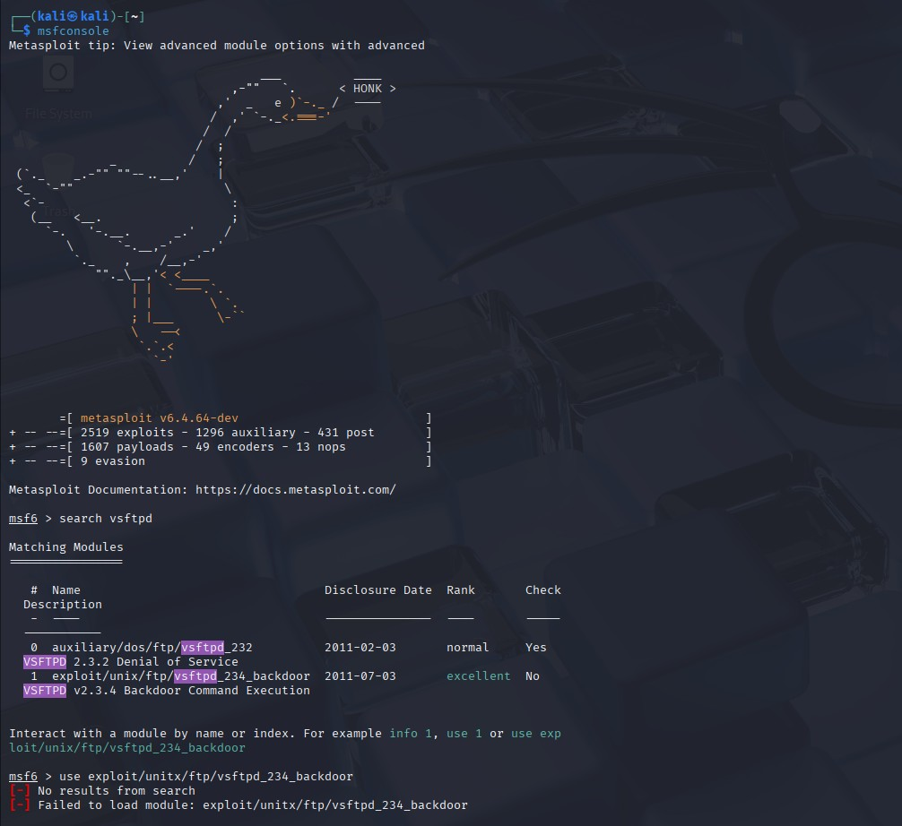
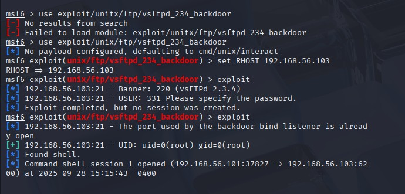
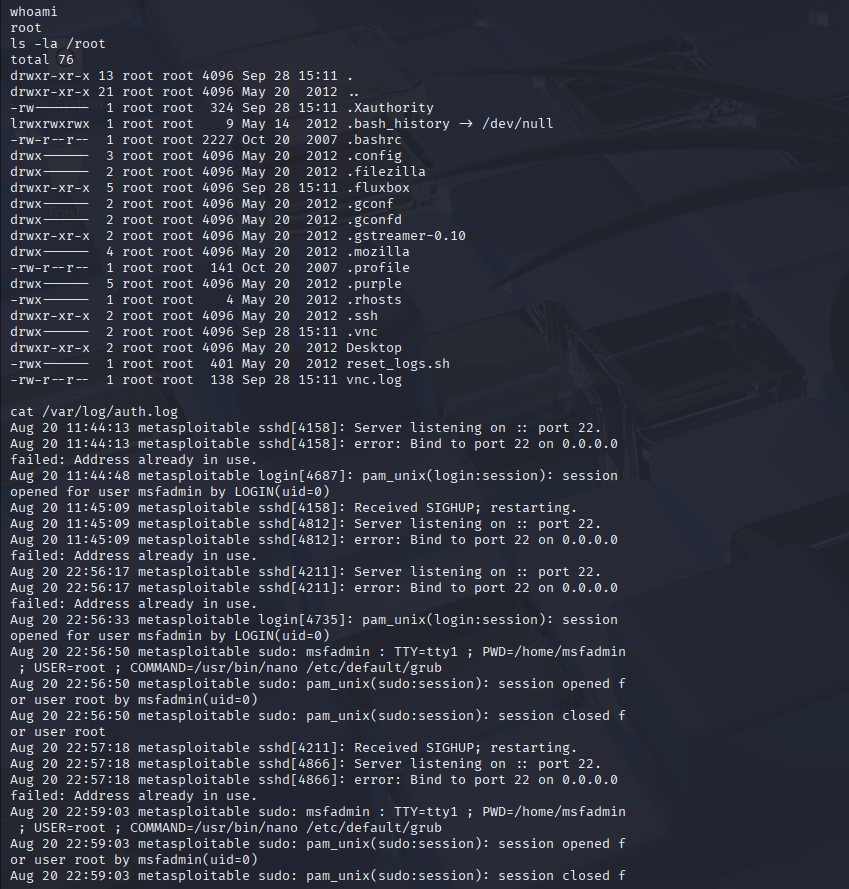
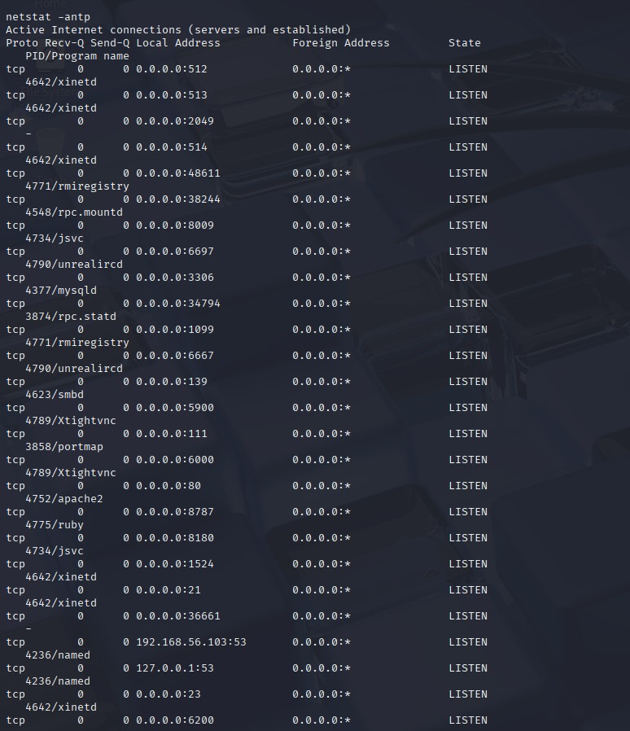

#### **Response to Analysis Questions**

Why was the vsftpd 2.3.4 service vulnerable?
The vsftpd 2.3.4 service was vulnerable due to a backdoor that was implanted in its source code by a malicious actor who compromised the official distribution. This was an intentional backdoor that was designed to provide unauthorized access and open a shell upon access.

How did the exploit work?
The exploit works in a couple of steps. First I scanned the target, in this case it was MS-2. I saw vsftpd 2.3.4 running. Then I searched vsftpd and found the backdoor module. I ran the module, set RHOST to the target and executed "exploit". When the module triggers the condition, the backdoor spawned a remote shell. I connected to the shell and because the vsftpd process runs as root, I got access to the root shell. Through this shell access, commands like whoami to check that I have control and persistence to the VM. 

What security measures could prevent this type of attack?
First, upgrading vsftpd to a trusted, patched build or using an alternative server would be a good fix. Second, it's important to installing binaries only from official sources. Third, blocking the port at the network perimeter and restricting access to only trusted hosts. Lastly implementing host-based Intrusion Detection systems and logging and suspicious activity. These security measured would prevent this type of attack.

---

## **Attack 4: Passive LAN Sniffing & Reconnaissance with Wireshark**  

### **Deliverables**  

#### **Screenshots**  
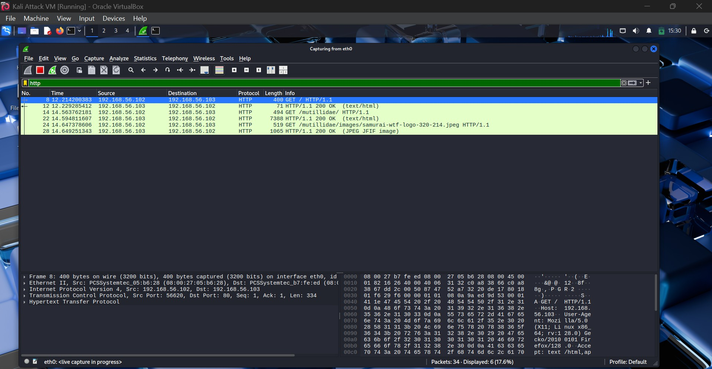
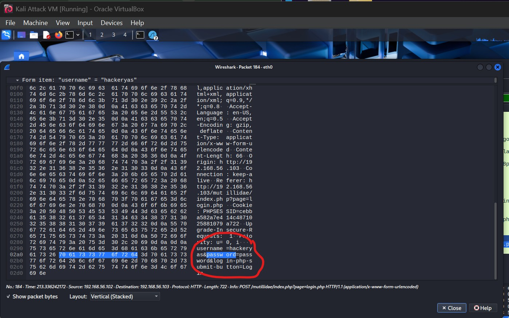

#### **Response to Analysis Questions**   

What did the attacker observe?
The attacker can observe through a couple of ways. From the Wireshark capture, the attacker captured HTTP traffic between the Defense VM(192.168.56.102) and MS-2(192.168.56.103). The capture shows sensitive data in headers and cookies and also the login page the victim entered credentials on- mutillidae. The attacker was also able to recover the form items username and password from the victim entering it on the login page. Thus it is a reconstruction of the requests and responses and any credentials sent between the two VMs

How could an organization prevent passive sniffing?
Most importantly, an organization can turn on HTTPS instead of HTTP. Then they can restrict port 80 which contains HTTP through internal firewall rules. Other network controls are: encrypting application traffic, hardening endpoints and enabling switch security features like port security, dhcp snooping, and dynamic ARP inspection.

Why is HTTPS important?
HTTPS is important because it encrypts all the HTTP traffic. It protects sensitive information like usernames, passwords, session cookies from passive sniffers. It also ensures integrity by preventing attackers from tampering with responses, and provides authentication so clients know they’re communicating with the real server.

---

