# CSCI 5743 – Assignment 3: Understanding CI Intrusions  
**Semester:** Fall 2025  
**Student Name:** Yaseer Sabir
**Student ID:** 111158157
**Total Points:** 100  

---

## **Section 1: Conceptual Assignments (25 pts)**

---

### **1. Cyber Kill Chain - Defensive Analysis** (5 pts)

**1.1 Briefly describe all seven stages of the Cyber Kill Chain:**

The Cyber Kill Chain provides a granular defense strategy to disrupt cyber intrusions at different stages before they escalate. In the first stage which is Reconnaissance, the goal is to to undertstand the target's infrastructure, weaknesses and personnel. The next stage is the Weaponization stage, where the goal is to develop a customized attack tool which could be a malware or exploit. The third stage is the Delivery stage in which the goal is to deliver the malicious code to the victim. The fourth stage is the Exploitation stage where the goal is to take advantage of vulnerabilities to execute malicious payloads. The fifth stage is the Installation stage where the goal is to ensure continued and persistant access to the compromised system. The sixth stage is the Command & Control stage where the goal is to maintain control over the infected systems. Finally, the seventh stage is the Actions on Objectives stage where the goal is to fulfill the attack objective such as data theft, destruction and expionage. In conclusion, the Cyber Kill Chain frames the attacker’s lifecycle so defenders can apply layered, stage-specific controls to detect, prevent, and disrupt adversary activity early and thereby reducing risk, limiting impact, and improving response and recovery.

**1.2 Choose 2 stages most critical to defenders and explain:**

- **Selected Stage 1:** Reconnaissance
  - *Why it’s important:* 
    - This stage is critical because it’s where attackers gather information about the target’s systems, employees, and vulnerabilities to plan precise and effective attacks. Detecting or disrupting reconnaissance can stop intrusions before they even begin.
  - *Defensive strategy:*
    - Reduce OSINT exposure by minimizing publicly available information and limit technical details in DNS and WHOIS records, restrict sensitive disclosures on websites and social media, and monitor for unauthorized data leaks that could aid attackers.

- **Selected Stage 2:** Installation
  - *Why it’s important:*
    - This stage is when attackers establish persistence on the target system, allowing long-term access even after detection attempts. Preventing successful installation can effectively stop the intrusion from progressing to data theft or control.
  - *Defensive strategy:*
    - Endpoint Detection and Response (EDR) solutions can identify and block suspicious file modifications, process creation, or persistence mechanisms, helping detect and remove malware before it becomes entrenched.

---

### **2. MITRE ATT&CK Framework in Practice** (10 pts)

#### **2.1 Scenario 1: Hypothetical Cyber Intrusion**

- **Tactic 1: Initial Access**  
  - **Technique ID & Name:** T1566.002 - Spearphishing Link.
  - **Description:** In this tactic, an attacker sends a phishing email containing a link to a fake login portal to harvest credentials. This was seen in the above scenario since it describes a user clicking a link and submitting credentials to a fake site, which is exactly credential harvesting via a spearphishing link; the harvested credentials were then used for VPN access.
  - **Defensive Measure:** MI021 - Restrict Web-Based Content: This defensive measure limits or blocks access to web content that users do not need, such as personal webmail or unsanctioned services thus reducing the chance that a user will click a malicious link embedded in a spear-phishing email.

- **Tactic 2: Persistance**  
  - **Technique ID & Name:** T1053 - Scheduled Task/Job
  - **Description:** Adversaries can create or modify Operating System scheduling entries  such as Windows Task Scheduler, cron, systemd timers among others to run malicious code repeatedly or at startup. In this scenario, the attacker created a scheduled task to maintain access even after a system reboot, ensuring their malicious presence persisted on the compromised host.
  - **Defensive Measure:** M1018 – User Account Management: This limit privileges of user accounts and remove privilege escalation vectors so that only authorized administrators can create or modify scheduled tasks on remote systems.

- **Tactic 3: Exfiltration**  
  - **Technique ID & Name:** T1041 - Exfiltration Over C2 Channel
  - **Description:** In this, adversaries use an existing command-and-control or encrypted HTTPS channel to send stolen data out to an external server, hiding exfiltration in normal-looking encrypted traffic. This relates to the scenario because the attacker compressed and exfiltrated sensitive financial data via an encrypted channel to an external server.
  - **Defensive Measure:** M1057 - Data Loss Prevention: Implement Data Loss Prevention (DLP) solutions to monitor, detect, and control the flow of sensitive information. DLP tools can be configured to block unauthorized attempts to exfiltrate data, such as preventing emails from being forwarded to external recipients or monitoring for suspicious data transfers. By creating email flow rules and applying policies to detect anomalies, DLP solutions help mitigate the risk of data exfiltration over alternative protocols.

#### **2.2 Scenario 2: CuttingEdge APT Campaign**

- **Reconnaissance Technique:**  
  - **Technique ID & Name:** T1592 - Gather Victim Host Information
  - **Use in Campaign:** The CuttingEdge APT gathered details about victim systems, such as hostnames, OS versions, and network configurations, to tailor later stages of the attack and ensure exploit compatibility.
  - **Impact:** This reconnaissance allowed the adversaries to identify high-value systems and determine the most effective initial access methods, improving the success rate of subsequent exploitation attempts.
  - **Defensive Control:** Implement network and endpoint monitoring to detect unauthorized system information queries; tools like OSQuery or EDR telemetry can flag suspicious inventory commands like systeminfo, ipconfig, or WMI queries run by unusual processes.

- **Exploitation Technique:**  
  - **Technique ID & Name:** T1203- Exploitation for Client Execution
  - **Use in Campaign:** The adversary exploited vulnerabilities in unpatched client applications to execute malicious payloads on victim endpoints, often delivered through weaponized documents or phishing attachments.
  - **Impact:** Successful exploitation enabled the attackers to run arbitrary code on target machines, establishing an initial foothold and bypassing normal user restrictions.
  - **Defensive Control:** Enforce regular patch management and vulnerability scanning using tools like Tenable/Nessus or Microsoft WSUS, combined with application whitelisting to block untrusted code execution.

- **C2 Technique:**  
  - **Technique ID & Name:** T1071.001 – Application Layer Protocol: Web Protocols (HTTPS)
  - **Use in Campaign:** CuttingEdge established encrypted HTTPS channels to communicate with its command-and-control servers, blending its traffic with legitimate web traffic to avoid detection.
  - **Impact:** This provided persistent remote control of compromised systems, allowing attackers to issue commands, exfiltrate data, and deploy additional payloads while evading network security tools.
  - **Defensive Control:** Deploy network intrusion detection systems (IDS) and TLS inspection tools like Zeek or Suricata to analyze outbound HTTPS connections for anomalies like unusual destinations, self-signed certificates, or repetitive beaconing patterns.

---

### **3. CVSS-Based Vulnerability Assessments** (10 pts)

#### **Scenario 1: Unauthorized Database Access**

- **CVSS Metrics:**
  - AV: Network 
  - AC: Low
  - PR: None
  - UI: None
  - S: Unchanged
  - C: High
  - I: None
  - A: None
- **CVSS Score:** 7.5
- **Justification:**  
*(Explain your rationale for each metric selection.)*
  - For the Attack Vector, since the scenario is exploitable remotely over the Internet through API endpoints, the attack needs only network access, hence I chose Network.
  - For the Attack Complexity, since the exploit requires no special conditions or complex configuration and the fact that the API can be queried directly, I said the complexity is Low.
  - For the Privileges Required, the attacker does not need any pre-existing credentials or privileges and they bypass authentication entirely, so the Privileges Required is None.
  - For the User Interaction, no legitimate user interaction is required since the attacker makes API calls directly and no social-engineering method is needed.
  - For the Scope, the exploitation compromises the application’s data but does not by itself change security control boundaries and the same component’s privileges are abused.
  - Confidentiality: Since the attacker gains full read access to sensitive customer Personally Identifiable Information, it is a major confidentiality breach and so the Confidentiality is High.
  - Integrity: Since the scenario states no write and delete capability, the attacker cannot modify data and thus the integrity impact is None.
  - Availability: I thought their wouldn't be an impact on availability since the scenario didn't describe any impact on availability and thus Availability is None.

#### **Scenario 2: Privilege Escalation on Internal Server**

- **CVSS Metrics:**
  - AV: Local
  - AC: Low
  - PR: Low
  - UI: None
  - S: Unchanged
  - C: High
  - I: High
  - A: High
- **CVSS Score:** 7.8
- **Justification:**  
*(Explain your rationale for each metric selection.)*
  - For the Attack Vector, the exploit requires the attacker to already have local and authenticated user access  since it’s not remotely exploitable and thus the Attack Vector is Local.
  - For the Attack Complexity, the exploit is well documented and does not require unusual timing or specialized environment, since the required command sequence is known and straightforward, so the Attack Complexity is low.
  - For the Privileges Required, the attacker needs only a user-level account and not adminintrator privileges to launch the exploit. This is less privilege than admin, so the Privileges required is Low rather than None.
  - For the User Interaction, no additional victim interaction is required beyond the attacker’s own actions and thus the attacker performs the exploit directly, so the User Interaction is None. 
  - For the Scope, the privilege escalation elevates within the same system component which is the server and it doesn’t necessarily change the trust boundary into another component, so the Scope is Unchanged.
  - Confidentiality: Since the superuser grants full access to files and data on the server and exposes confidential information, the confidentiality impact is high.
  - Integrity: Since a superuser can modify or corrupt data and system binaries, the integrity impact here is High.
  - Availability: Since a superuser can stop services, delete files, and otherwise disrupt operations, the availability impact here is High.

#### **Comparison and Risk Reflection**

- *Which scenario is riskier?*
  - Although I got the Scenario 2 as a slightly higher CVSS score (7.8 vs 7.5), Scenario 1 is riskier in practice because it’s internet-facing and requires no authentication or user interaction. Anyone online can exploit the exposed API to harvest sensitive customer Personally Identifiable Information at scale, creating a much larger impact and immediate regulatory, financial, and reputational consequences. Its ease of exploitation and global exposure make it a higher real-world risk than a local privilege-escalation flaw confined to the internal network.
- *Which should be prioritized and why?*
  - Scenario 1 should be prioritized first because it poses an immediate, organization-wide threat: remote, unauthenticated data exposure can be exploited automatically by external attackers. Fixing it quickly—by enforcing authentication, restricting public access, and patching the API will eliminate the highest likelihood and highest impact entry point. Scenario 2 should still be remediated soon after, but its prerequisite of local access means it’s less likely to be exploited rapidly or broadly.

---

## **Section 2: Practical Lab – Intrusion Simulation & Exploitation (75 pts)**

---

### **Task 1: Reconnaissance** (20 pts)

#### **1-1: Netdiscover**

**Screenshot:**  
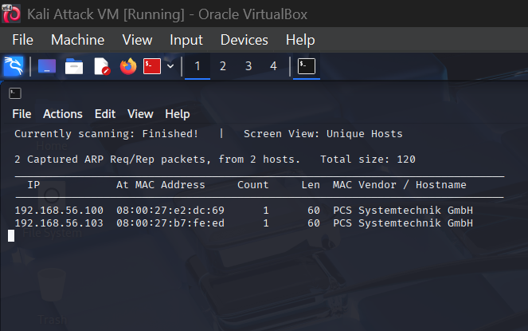
**Analysis Questions:**
1️⃣ What does `netdiscover` do, and what protocol does it use?  

  Netdiscover scans my local LAN to find live hosts and maps IP to MAC addresses and vendor information. It works at layer 2 using ARP requests/replies in which active mode sends ARP probes and  passive mode just listens.

2️⃣ What is the IP address of Metasploitable 2 (MS-2)?  
  The IP address of MS-2 is 192.168.56.103 .

---

#### **1-2: Nmap SYN Scan**

**Screenshot:** 
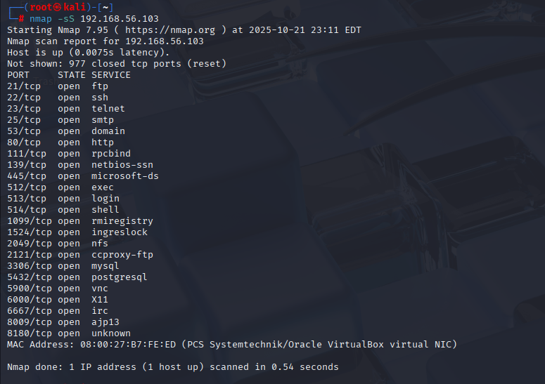
**Analysis Questions:**
3️⃣ List all open ports on MS-2.  
  The open ports and their services are: 21 (ftp), 22 (ssh), 23 (telnet), 25 (smtp), 53 (domain), 80 (http), 111 (rpcbind), 139 (netbios-ssn), 445 (microsoft-ds), 512 (exec), 513 (login), 514 (shell), 1099 (rmi-registry), 1524 (ingreslock), 2049 (nfs), 2121 (ccproxy-ftp), 3306 (mysql), 5432 (postgresql), 5900 (vnc), 6000 (X11), 6667 (irc) and 8009 (ajp13).

4️⃣ What is the most dangerous open service and why?  
  The most dangerous open service in that scan is Telnet (port 23) because it transmits all data, including login credentials, in cleartext, making it easy for attackers to intercept, capture credentials, or gain unauthorized remote access.

---

#### **1-3: Nmap Version Detection**

**Screenshot:**  
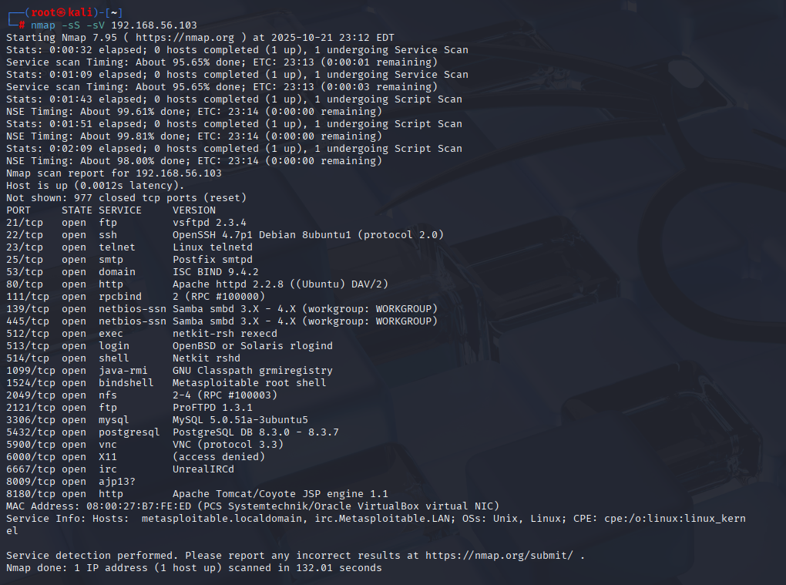

**Analysis Questions:**
5️⃣ What version of PostgreSQL is running on MS-2?  
  The version that's running on MS-2 is PostgreSQL DB 8.3.0 - 8.3.7

6️⃣ Why is version detection important in penetration testing?  
  Version detection tells us what exact software and version is running on a service, which is critical because specific versions map to known CVEs and public exploits, so it lets us pick realistic, effective attacks instead of blind guesses. It also reduces false positives, helps prioritize high-risk targets, aids exploit compatibility (payloads/aux modules), and informs accurate remediation (patch/version upgrade) recommendations.

---

#### **1-4: Vulnerability Scan (PostgreSQL)**

**Screenshot:**  
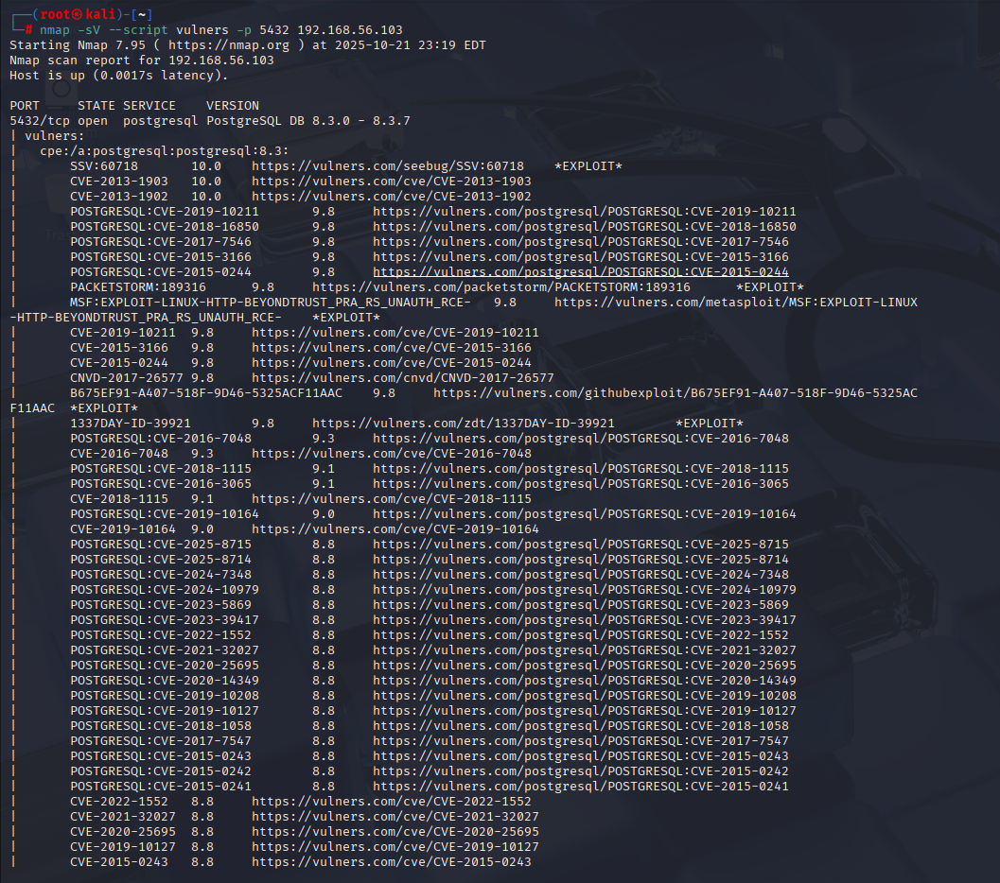

**Analysis Questions:**
7️⃣ List and rank the top 3 services.  
1) Postgresql — port 5432
2) Telnet — port 23
3) Microsoft-ds — port 445
  
8️⃣ Justify your choices.  
   1) PostgreSQL— most attractive and highest risk. It stores database contents and the nmap -sV --script=vulners output shows an old PostgreSQL version (8.3.x) with many CVEs and labeled *EXPLOIT*. Old DB servers commonly have remote-executable or privilege-escalation exploits and, if reachable over the network, let an attacker dump or manipulate data and create privileged DB users. Because it both stores sensitive data and appears unpatched/exploitable, it’s the top target.
   2) Telnet — easy initial access and credential capture. Telnet transmits credentials and session data in cleartext, so it’s trivial for an attacker on the same network to capture usernames/passwords. Telnet is also frequently left with weak/default credentials on lab or misconfigured hosts, making it a low-effort entry point for lateral movement or privilege escalation.
   3) Microsoft-ds (445) — high impact if exploited. Microsoft-ds exposes file shares and often runs with elevated privileges; past Microsoft-ds vulnerabilities have allowed remote code execution and full compromise like ransomware and credential theft patterns. Even if not currently exploitable, misconfigured shares or weak service ACLs let attackers read/modify data or escalate privileges after gaining a foothold.

9️⃣ Summarize the scan output.  
    The scan shows that PostgreSQL (port 5432) is running an outdated version (8.3.0–8.3.7) with numerous high-severity vulnerabilities (CVSS scores 8.8–10.0), including several known remote-code-execution exploits. In short, this database service is critically vulnerable and could allow an attacker to gain full control of the host or extract sensitive data if left unpatched.

🔟 Were any vulnerabilities or warnings reported?  
    Yes, the scan output clearly reported many known vulnerabilities and flagged “EXPLOIT” for some of them. For example, versions of PostgreSQL 8.3.x are noted as affected by CVE-2012-0868 (arbitrary SQL execution via crafted pg_dump object names) and CVE-2013-1902 (predictable temporary files) among others. Furthermore, the PostgreSQL security page explicitly labels version 8.3 as unsupported and vulnerable.

1️⃣1️⃣ How can this inform an attacker's strategy?  
    An attacker would prioritize the exposed, high-severity PostgreSQL bugs (and any labeled *EXPLOIT*) to attempt remote code execution or privilege escalation first, then use successful access to dump sensitive data and pivot laterally into the network. They’d pick proven exploit modules that match the exact version, verify exploitability non-noisily to avoid detection, and chain access with credential harvesting and persistence, all while preferring high-confidence, high-impact vectors over low-yield probes.

---

### **Task 2: PostgreSQL Login with Default Credentials** (10 pts)

**Screenshot:**  
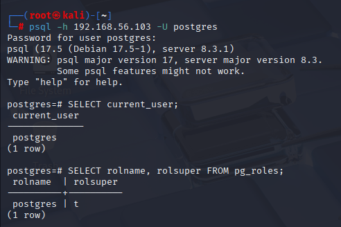

**Analysis Questions:**
1️⃣2️⃣ Were you able to connect with default credentials?  
  Yes I was able to connect with the default credentials.

1️⃣3️⃣ What privileges does the `postgres` user have?  
  The postgres user is a superuser(where it says rolsuper = t in the image). The postgres user has  full administrative privileges, which means it can bypass permission checks, create/drop roles and databases, read/modify any data, install extensions, and perform config/replication/admin tasks.

---

### **Task 3: Exploit PostgreSQL for RCE via Metasploit** (15 pts)

**Screenshot(s):**  
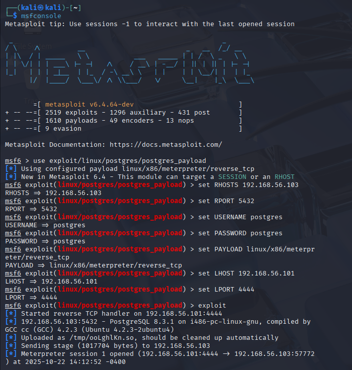
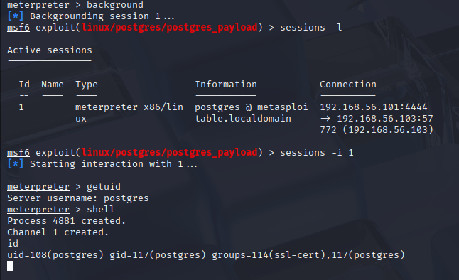

**Analysis Questions:**
1️⃣4️⃣ What happens when this exploit runs successfully?  
  When this exploit runs successfully, a payload is delivered to the PostgreSQL process and is executed on the target host which is MS-2 here. Further, a reverse TCP connection is opened back to my Kali Attack VM. The handler's accepts the connection and upgrade it into a meterpreter session, from which I can interact with from the msfconsole. Code execution occurs on the target, a remote shell is establiehd, and an interactive meterpreter session is created back to the attacker vm.

1️⃣5️⃣ What privileges do you have after exploitation?  
  Since I confimed getuid returned postgres and id from the shell, I inhereted all privileges of the postgres user. I can access the local database using the Unix socket, read/modify database contents, create and drop roles, and access files that the postgres accoutn can read or write. 

---

### **Task 4: Persistence - Create a Backdoor PostgreSQL Superuser** (10 pts)

**Screenshot:**  
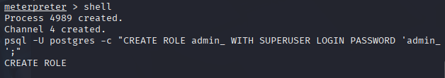
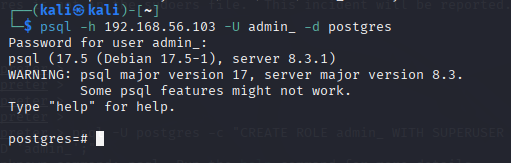

**Analysis Questions:**
1️⃣6️⃣ Why is it dangerous for attackers to create hidden superusers?  
  It's dangerous for attackers to create hidden superusers because it's gives an attacker(here me) full and persistant control over the database. I can bypass all permission checks, create or drop objects, read or modify any data, install extensions or scheduled tasks and add backdoors. This makes detection much harder. Therefore, one hidden superuser can essentially nullify security controls and enable long-term data theft, tampering, or ransomware.

1️⃣7️⃣ What happens if this account goes undetected?  
  If a hidden superuser goes undetected, the attacker has full, persistant control over the database and can quietly exfiltrate or modify sensitive data and create backdoors. Over time, this can lead to data theft, integrity violations and long-lasting loss of trust.

---

### **Task 5: Privilege Escalation with Setuid Nmap Exploit** (10 pts)

**Screenshot:**  
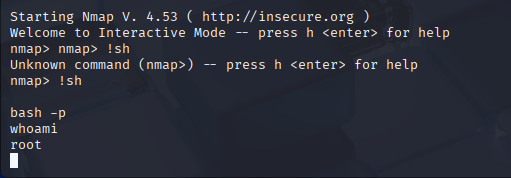

**Analysis Questions:**
1️⃣8️⃣ Did the exploit grant root access?  
  Yes, the exploit granted me root access as seen when I run the whoami command.

1️⃣9️⃣ What is the risk of leaving setuid binaries accessible to unprivileged users?  
  The risk of leaving setuid binaries accessible to unprivileged users is that setuid binaries run with the file owner’s privileges, root here, so if unprivileged users can run a vulnerable or misconfigured setuid binary they can escalate to those higher privileges which is full root access.

---

### **Task 6: Defense Evasion - Covering Tracks (Log Tampering)** (10 pts)

**Screenshot:**  
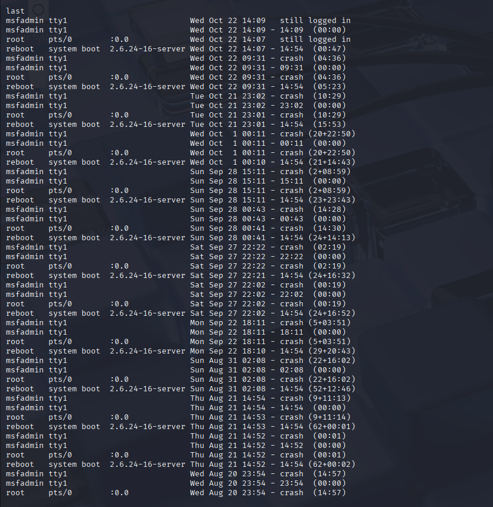
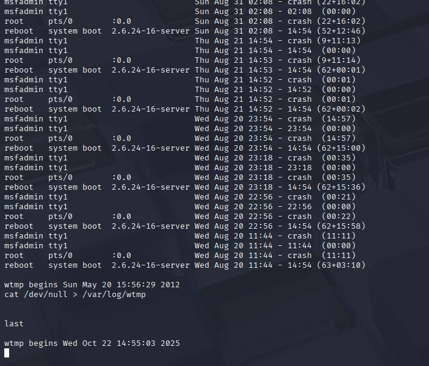

**Analysis Questions:**
2️⃣0️⃣ Why do attackers erase logs?  
  The attackers erase logs so that they can hide their activity by removing evidence of access, commands run, or files transferred. This makes detection, attribution, and forensic investigation much harder. 

2️⃣1️⃣ What security measures can detect log tampering?  
  Security measures that can detect log tampering include centralized logging, where logs are sent to a remote, write-once server so that attackers can’t alter local copies, and integrity checks, such as cryptographic hashing or digital signatures that verify logs haven’t been changed. Other methods include file integrity monitoring tools (like Tripwire or AIDE) and SIEM alerts that detect log deletions, truncations, or suspicious gaps in timestamps.

