# **CSCI 5743 – Assignment 4: Defense against CI Intrusions**

**Semester:** Fall 2025
**Student Name:** Yaseer Sabir
**Student ID:** 111158157
**Total Points:** 200

---

## **Part 1: Conceptual Questions (65 pts)**

---

### **Task 1: Real-World Breach Analyses (30 pts)**

#### **1. Capital One Cloud Breach (2019)**

**Prompt:** Explain how principles like *Least Privilege*, *Separation of Duties*, and *Continuous Monitoring* were violated in this breach, and how proper enforcement would have limited or prevented unauthorized access.

   The 2019 Capital One cloud breach demonstrated clear violations of the security principles of Least Privilege, Separation of Duties, and Continuous Monitoring. The attacker exploited a misconfigured AWS Web Application Firewall role that had far more permissions than necessary, violating the Least Privilege principle. Instead of limiting the WAF’s access to only what was required for its specific function, the role allowed broad interaction with Amazon S3 buckets, enabling the attacker to retrieve sensitive data. The breach also revealed a failure in Separation of Duties because the WAF role combined multiple operational responsibilities that should have been assigned to different roles with distinct permission boundaries. This consolidation created a single point of failure that the attacker could leverage. Finally, the prolonged undetected activity showed weaknesses in Continuous Monitoring. Effective monitoring tools and alerting systems should have flagged unusual access patterns or unexpected data exfiltration. If these principles had been properly enforced, the attacker’s actions would have been restricted at multiple points: limited permissions would have prevented broad data access, separated duties would have reduced the impact of the compromised role, and strong monitoring would have detected the intrusion much earlier, minimizing potential damage.

---

#### **2. Equifax Breach (2017)**

**Prompt:** Analyze the role of *Fail‑Safe Defaults* and *Least Functionality* in this breach. How would applying these principles have prevented external access to the vulnerable application?

   The 2017 Equifax breach highlighted major failures in the security principles of Fail-Safe Defaults and Least Functionality. The vulnerable Apache Struts application was publicly accessible, even though it included components and services that were not essential to its core business purpose. This violated the principle of Least Functionality, which requires systems to be configured with only the minimum features and services necessary. By exposing unnecessary components to the internet, Equifax broadened the attack surface and made it easier for attackers to exploit the unpatched vulnerability.
   Additionally, the system did not follow Fail-Safe Defaults, which dictate that access should be denied by default unless explicitly permitted. Instead, the application was openly reachable from the internet, creating a permissive security posture. If Fail-Safe Defaults had been applied, the system would have blocked external access automatically, preventing attackers from reaching the vulnerable Struts component at all.
   Enforcing both principles would have significantly reduced the likelihood of the breach. Restricting the system to only essential functions would have minimized exploitable entry points, while default-deny network rules would have ensured that unpatched or misconfigured components were not exposed to the public. Together, these safeguards could have prevented external access and stopped the attackers from exploiting the vulnerability in the first place.

---

#### **3. Target Breach (2013)**

**Prompt:** Identify the failures in *Network Segmentation* and *Zero Trust*. How would implementing stronger segmentation and stricter access verification have blocked lateral attacker movement?

   The 2013 Target breach revealed major failures in both Network Segmentation and Zero Trust principles. Because Target’s internal network was largely flat, the attackers—using credentials stolen from a third-party HVAC vendor—were able to move laterally with little resistance. This lack of segmentation meant that systems of vastly different sensitivity levels, from vendor platforms to point-of-sale systems, existed on the same trusted network space. As a result, once attackers gained any foothold, they could pivot freely toward increasingly critical assets. The breach also exposed a clear violation of Zero Trust, which requires continuous verification rather than assuming that internal traffic or authenticated users are inherently trustworthy. In Target’s environment, internal communications were largely unchecked, and third-party credentials were implicitly trusted without additional validation or restrictions. If strong segmentation had been implemented—such as isolating vendor networks, limiting communication pathways, and blocking unnecessary routes—the attackers would not have been able to reach payment-processing systems. Likewise, Zero Trust measures, such as strict authentication, least-privilege access rules, and ongoing verification of internal behavior, would have detected or denied unauthorized lateral movement. Together, these controls would have created internal barriers that prevented attackers from traversing the network, significantly limiting or fully stopping their ability to access sensitive customer payment data.

---

#### **4. SolarWinds Supply Chain Attack (2020)**

**Prompt:** Discuss the lack of *Zero Trust*, *Continuous Monitoring*, and *Open Design*. How could implementing these principles have contained the spread or improved detection?

   The SolarWinds supply chain attack demonstrated clear weaknesses in Zero Trust, Continuous Monitoring, and Open Design principles. The compromised Orion software was implicitly trusted once installed, violating Zero Trust by assuming that updates from a known vendor were inherently safe. This allowed the SUNBURST backdoor to operate freely inside highly sensitive networks without frequent reauthentication or behavior-based verification. Continuous Monitoring was also insufficient, as the malicious activity blended into normal network operations and remained undetected for months. More proactive monitoring—such as anomaly detection, behavioral analytics, and verification of software integrity—could have flagged unusual communication patterns or unauthorized changes earlier. Additionally, the attack reflected a lack of Open Design, which emphasizes transparency in system architecture and secure development practices. Limited visibility into the software build pipeline and inadequate integrity checks made it easier for attackers to insert malicious code without detection. If these principles had been applied, organizations would not have automatically trusted the compromised software, stronger monitoring would have detected abnormal behavior far sooner, and transparent, secure build processes could have prevented tampering or at least exposed it before deployment. Collectively, these controls would have greatly reduced the scope of the attack and contained its spread across high-value networks.
   
---

#### **5. Colonial Pipeline Ransomware (2021)**

**Prompt:** Explain the breakdown of *Accountability & Non‑repudiation*, *Continuous Monitoring*, and *Layered Defense*. How would enforcing these principles—especially MFA and audit logging—have changed the attacker’s access path?

   The Colonial Pipeline incident showed critical failures in Accountability and Non-repudiation, Continuous Monitoring, and Layered Defense. Because the attacker accessed the network using a valid VPN account that lacked multi-factor authentication, the system could not reliably verify the true identity behind the login, breaking Accountability and Non-repudiation. Without strong audit logging or user-specific activity tracking, malicious behavior could not be traced or attributed, allowing the attacker to operate unnoticed. Continuous Monitoring also failed, as there were no effective mechanisms to detect unusual login patterns, suspicious file activity, or abnormal lateral movement once the attacker entered the network. This absence of real-time alerting enabled the ransomware deployment to progress undetected. Additionally, the lack of Layered Defense meant that once the attacker passed the initial authentication barrier, there were few additional safeguards—such as MFA prompts on sensitive systems, internal segmentation, or access re-verification—to prevent deeper infiltration. If these principles had been enforced, the attacker’s path would have been significantly hindered. MFA would likely have blocked the compromised VPN account from being used at all, while comprehensive audit logs and continuous behavior monitoring would have flagged suspicious actions early. Layered security controls would have added further checkpoints, preventing a single compromised credential from triggering a major operational shutdown.

---

### **Task 2: MITRE ATT&CK → D3FEND Mapping (20 pts)**

#### **ATT&CK ↔ D3FEND Mapping Table**

| **Tactic**      | **Technique (ID & Name)** | **Scenario Use** | **D3FEND Countermeasure 1 (Name / Category)** | **Justification** | **D3FEND Countermeasure 2 (Name / Category)** | **Justification** |
|-----------------|---------------------------|------------------|-----------------------------------------------|-------------------|-----------------------------------------------|-------------------|
| Initial Access  | T1566.001 – Spearphishing Attachment | Attacker sends a tailored phishing email with a malicious attachment. | Email Filtering / Detect | Detects and blocks malicious email attachments before the user can open them. | Attachment Content Disarm & Reconstruction (CDR) / Harden | Neutralizes potentially harmful content inside attachments by sanitizing them. |
| Persistence     | T1547 – Boot or Logon Autostart Execution | Attacker installs a backdoor to maintain long-term access. | Boot Integrity / Harden | Verifies the integrity of boot and logon configurations to detect unauthorized persistence mechanisms. | Execution Isolation / Isolate | Prevents unauthorized processes from automatically executing during system startup or user logon. |
| Defense Evasion | T1027 – Obfuscated Files or Information | Malware uses packing and encoding to evade endpoint detection. | Binary Analysis / Detect | Detects packed or obfuscated malware by analyzing file structure, behavior, or entropy. | Behavioral Monitoring / Detect | Identifies suspicious runtime behavior even when code is obfuscated or encrypted. |
| Discovery       | T1087 – Account Discovery *(or T1018 – Remote System Discovery)* | Attacker performs internal reconnaissance to identify systems and credentials. | Network Traffic Analysis / Detect | Detects unusual scanning or enumeration behavior within internal network traffic. | Credential Access Monitoring / Detect | Flags anomalous account queries or enumeration attempts that deviate from normal activity. |
| Exfiltration    | T1041 – Exfiltration Over C2 Channel | Data is stolen through an encrypted C2 channel. | Encrypted Channel Monitoring / Detect | Identifies suspicious encrypted outbound connections, especially those not matching normal communication patterns. | Data Loss Prevention (DLP) / Harden | Prevents or alerts on attempts to transfer sensitive data to unauthorized external destinations. |

   Defending against this intrusion requires a layered security strategy targeting each phase of the attack. Email protection and content disarmament address the initial access vector by preventing malicious attachments from ever reaching users. Persistence mechanisms are countered through strong boot integrity verification and isolation controls that block unauthorized startup processes. Because the attacker relies on obfuscation to evade detection, binary analysis and behavioral monitoring help uncover hidden or disguised malicious activity. Internal reconnaissance attempts are disrupted through network traffic analysis and credential monitoring, which detect anomalous scanning or account enumeration. Finally, encrypted outbound data theft is mitigated through monitoring of suspicious secure channels and data-loss-prevention controls that stop sensitive information from leaving the organization. This combined approach reduces the attacker’s ability to progress through the kill chain and exfiltrate valuable data.

---

### **Task 3: NIST CSF ↔ SP 800‑53 Mapping (15 pts)**

#### **Table: CSF Functions Mapped to Controls**

| **CSF Function** | **Category / Subcategory** | **SP 800‑53 Controls** | **Explanation (How the control operationalizes the CSF outcome)** |
| :--------------- | :------------------------- | :--------------------- | :---------------------------------------------------------------- |
| Govern          | Organizational Context                           | PM-1 Project Management– Information Security Program Plan                       | Establishes the organization’s security governance structure, responsibilities, and scope, enabling a clear understanding of cybersecurity context and strategic direction.                                                                  |
| Identify           | Asset Management                           | CM-8 Configuration Management– System Component Inventory                        | Requires maintaining a detailed inventory of system components, hardware, software, and services, enabling the organization to understand what assets exist and must be protected.                                                                  |
| Protect          | Identity Management, Authentication, and Access Control                           | AC-2 Access Control– Account Management**                        | Enforces creation, monitoring, and removal of accounts, ensuring only authorized users have access to systems and resources in accordance with identity/access policies.                                                                  |


---

## **Part 2: Hands‑On Labs (135 pts)**

---

### **Task 1: Firewall Configuration & Analysis (45 pts)**

#### **1️⃣ Baseline Testing (before firewall)**

**Screenshots:**

***ICMP Flood Test(Ping Flood)***
* 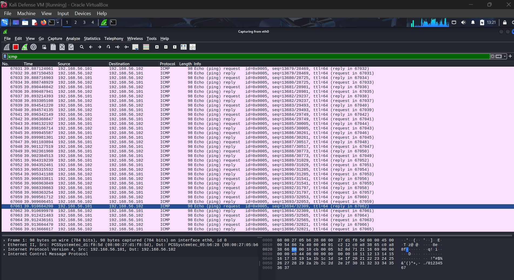

***Web Server Availability***
* 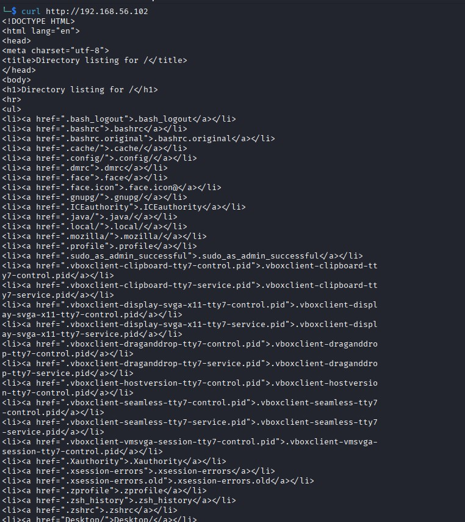
* 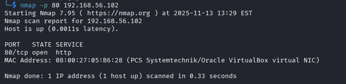

***SSH into the Defense VM***
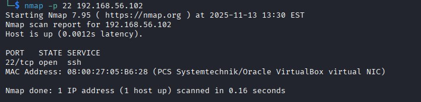
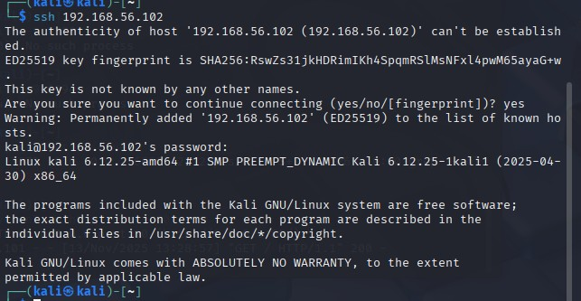

**Observations:**
   Before enabling or modifying any firewall rules, the target system at 192.168.56.102(Kali Defense) is fully reachable within the VirtualBox Host-Only network. Multiple services respond normally, and no filtering is observed. From the Wireshark capture, the host allows ICMP through with no firewall interference. Ports 80 and 22 are open. Nmap overall shows very low latency (0.001–0.002s) and host immediately responds to probes.

---

#### **2️⃣ Firewall Rule Application**

**Commands Executed:**

```bash
# Allow incoming HTTP (port 80) from any source
sudo iptables -A INPUT -p tcp --dport 80 -m state --state NEW,ESTABLISHED -j ACCEPT
sudo iptables -A OUTPUT -p tcp --sport 80 -m state --state ESTABLISHED -j ACCEPT
# Allow outgoing ICMP echo-requests (ping) and allow replies
sudo iptables -A OUTPUT -p icmp --icmp-type echo-request -j ACCEPT
sudo iptables -A INPUT -p icmp --icmp-type echo-reply -j ACCEPT
# Default policies (if not already applied)
sudo iptables -P INPUT DROP
sudo iptables -P OUTPUT DROP
```

**Screenshot:**
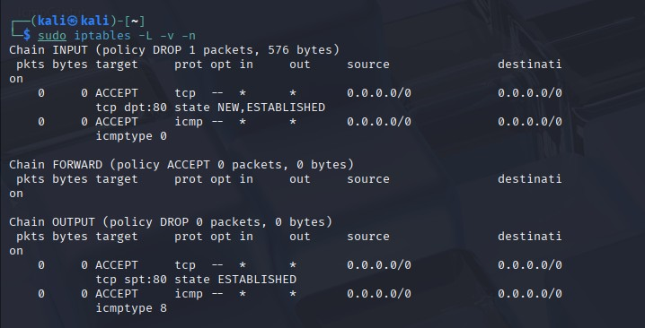

---

#### **3️⃣ Post‑Firewall Testing & Analysis**

**Screenshots:**
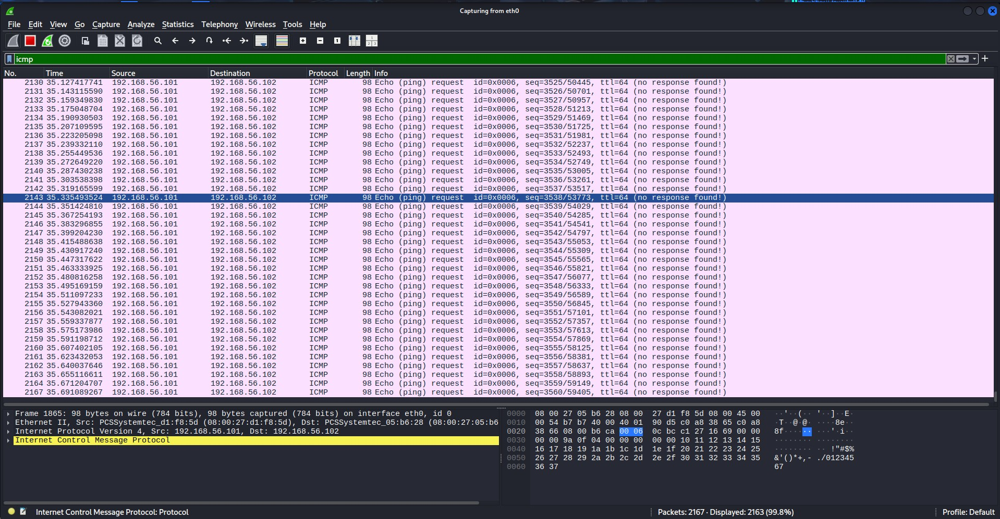
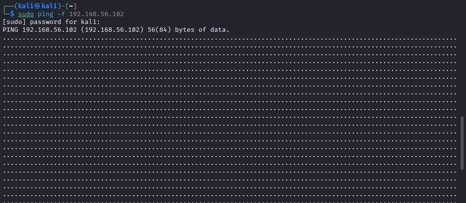

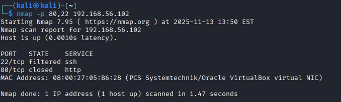

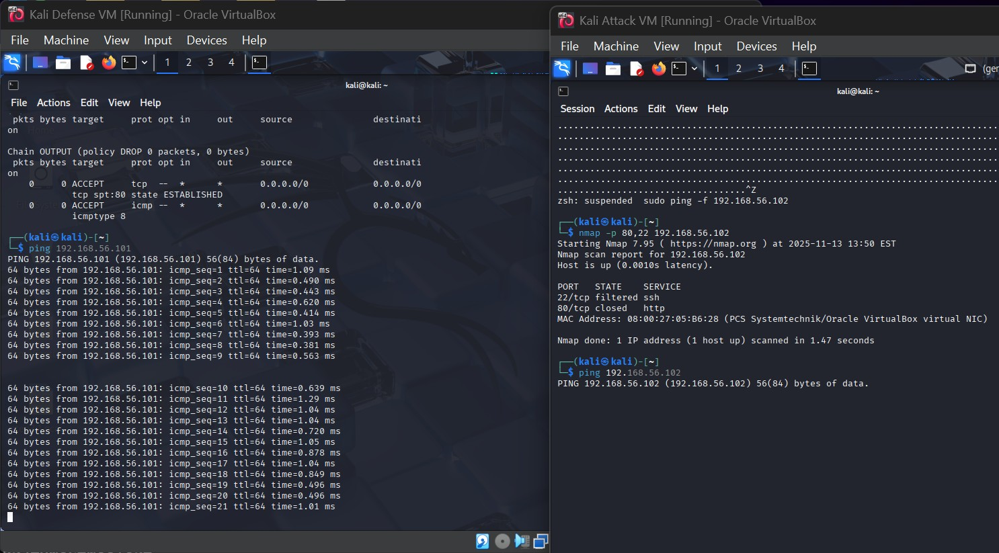


**Observations:**
After applying the firewall rules, connectivity changed significantly from the pre-firewall state. Inbound ICMP is now blocked: Wireshark shows ICMP Echo Requests from the attacker but no Echo Replies, and the attacker’s flood ping returns only dots. However, outbound ICMP still works, as the defense VM can ping the attacker normally, outbound traffic isn’t restricted, and ESTABLISHED state allows return packets. Service accessibility also changed: before the firewall, SSH (22/tcp) and HTTP (80/tcp) were fully reachable, but after enforcement, Nmap shows SSH as filtered (silently dropped) and HTTP as closed (RST returned). Overall, the system now restricts all unsolicited inbound traffic while still permitting outbound and established connections, demonstrating correct stateful firewall behavior.

---

#### **Analysis Questions**

1. Why specify `NEW,ESTABLISHED` in the INPUT chain for port 80?
   We specify NEW,ESTABLISHED in the INPUT chain for port 80 because HTTP traffic requires both new inbound connections and the continuation of already-established TCP sessions. The NEW state allows external clients to initiate a new TCP handshake toward the web server, while ESTABLISHED allows packets that belong to an already-approved session, such as ACK and data packets, to enter the system. If ESTABLISHED were omitted, the server would allow the client’s initial SYN packet but would drop the follow-up ACK and data packets, causing legitimate connections to break immediately after the handshake. This is why stateful inspection is essential: it allows the firewall to distinguish between new connection requests and valid ongoing sessions.
2. Why only `ESTABLISHED` on OUTPUT for port 80?
   The OUTPUT chain allows only ESTABLISHED connections because the server should not be initiating outbound HTTP connections to other systems. Its only role is to respond to inbound requests. Outbound NEW connections would be unnecessary and potentially insecure, exposing the server to misuse or compromise if an attacker gained a foothold. By allowing only ESTABLISHED packets in OUTPUT, the firewall ensures that response packets for legitimate client-initiated sessions are allowed out, while preventing the server from creating new outbound web traffic that it does not need.
3. What risks arise if state tracking is omitted?
   Without state tracking, the firewall would treat every packet independently rather than as part of a session, creating several security risks. The system would become vulnerable to spoofed ACK, SYN-ACK, or other packets that appear to belong to a legitimate connection but are actually malicious. Attackers could bypass stateless filters by forging packet flags or hijacking half-open sessions. TCP session hijacking would become easier because the firewall would have no awareness of which connections are legitimate. Additionally, the firewall would be forced to allow or deny entire ports without considering connection stages, dramatically weakening the protection model.
4. Why limit ICMP by type instead of state?
   ICMP is not typically tracked by connection-state modules because ICMP traffic is not session-oriented the way TCP is. Instead, ICMP types represent specific message categories (echo-request, echo-reply, TTL exceeded, destination unreachable, etc.). Using type-based filtering gives precise control over exactly which diagnostic behaviors are permitted. Allowing only outbound echo-requests and inbound echo-replies ensures the server can test connectivity while preventing outsiders from probing the system with inbound pings. Stateful filtering adds no meaningful benefit for ICMP in this scenario because it is simpler and more secure to explicitly allow only the message types needed.
5. What changed after applying the firewall?
   Before the firewall, the attacker could ping the defense VM, access the HTTP directory listing, and successfully SSH into the system. After enforcing the firewall rules, inbound pings stopped receiving replies (Wireshark showed “no response found”), SSH became filtered, meaning packets were silently dropped, and port 80 changed from open to closed. However, outbound pings from the defense VM to the attacker still worked, demonstrating that outbound communication remained functional. These changes show that inbound access was heavily restricted while selective outbound traffic was still allowed.
6. Did the rules behave as intended?
   The observed changes confirm that the firewall worked exactly as intended: inbound ICMP echo-requests were blocked, inbound SSH was filtered, and HTTP access was restricted depending on your rules. Legitimate outbound connections still functioned, and established stateful connections behaved correctly. No unexpected traffic was allowed, and no unintended services remained exposed. The results indicate that the firewall correctly minimized the attack surface while maintaining necessary functionality, showcasing proper stateful and directional filtering.
7. What extra rules are advisable for a DMZ server?
   A real production web server in a DMZ would need additional rules to support essential services securely. These may include allowing inbound HTTPS (443/tcp) for encrypted web traffic, permitting outbound DNS (53/udp) so the server can resolve domain names, and configuring logging, rate-limiting, or fail2ban-style protections to mitigate brute-force attempts. Rules for outbound package updates (APT over 80/443) may also be required. Finally, implementing connection limits, SYN-flood protection, and strict outbound restrictions would be essential for hardening a production environment.
8. How do these rules enforce *attack surface minimization*?
   Attack-surface minimization is achieved by allowing only the specific services the server needs to expose—such as HTTP—and blocking everything else by default. By disabling SSH, inbound ping, and all unnecessary outbound connections, the server becomes far less visible and less interactive to an attacker scanning the network. Fewer reachable services mean fewer potential vulnerabilities. Restricting ICMP also reduces reconnaissance opportunities. Overall, the firewall significantly shrinks the number of ways an attacker could interact with or exploit the system.
9. How does this embody *least privilege*?
   The firewall grants only the permissions required for the server to function as intended. It allows only HTTP traffic and the minimal ICMP necessary for outbound diagnostics, while denying SSH, other TCP ports, and unsolicited inbound packets. The rules do not provide any unnecessary access; every permitted action directly aligns with its operational purpose. This strict limitation of privileges prevents abuse and ensures that services operate only within their intended boundaries, which is the core of the least-privilege principle.
10. How do default DROP policies support *fail‑safe defaults*?
    Fail-safe defaults mean denying all traffic unless it is explicitly allowed. The firewall uses DROP as its default policy for inbound traffic, ensuring that any traffic not explicitly permitted is automatically blocked. This protects the system from accidental exposures, misconfigurations, or unknown traffic types. Only the rules that explicitly allow HTTP, certain ICMP types, and ESTABLISHED responses override the default denial. This design ensures that the server remains secure even if new services are installed or configuration changes occur without corresponding firewall updates.

---

### **Task 2: Login Anomaly Detection with ML (45 pts)**

#### **Environment Setup**

* IDE used: Jupyter
* Python Version: 3.13.7
* Libraries installed: `pandas`, `scikit‑learn`

---

#### **1️⃣ Step 1:Dataset Inspection**

**Screenshot:**
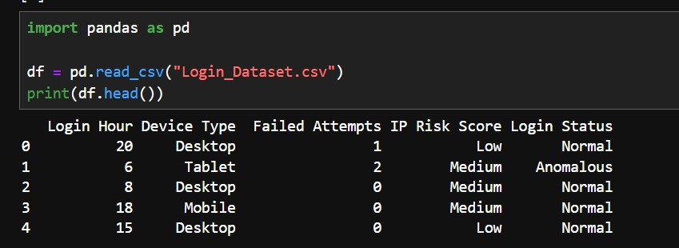

The login hour is the hour when the login occurred. Device type is the type of device used for the login. Failed attemps are the number of failed login attempts before a successful login. Higher values could indicate brute-force or suspicious activity. IP Risk Score is a risk classification for the login's originating IP address. And finally, the Login Status indicates whether the login is considered normal or anamalous.The target variable is the login status. It's the column which my machine-learning model should learn to predict.

---

#### **2️⃣ Model Training Output**

**Code Executed:**

```python
clf = DecisionTreeClassifier(max_depth=3, random_state=42)
clf.fit(X_train, y_train)
```

**Screenshot:** 
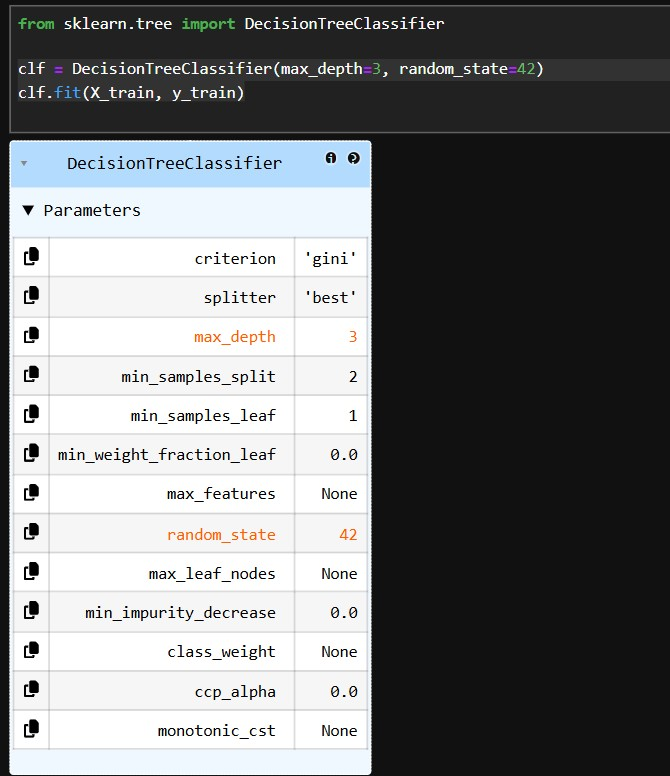

---

#### **3️⃣ Evaluation Metrics**

| Metric    | Value |
| :-------- | :---- |
| Accuracy  | 0.925 |
| Precision | 0.875 |
| Recall    | 1.0   |
| F1 Score  | 0.9333333333333333 |'

Confusion Matrix: [[16  3] [ 0 21]]

---

#### **Analysis Questions**

1. Report metrics above (with screenshot).
   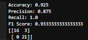
   Based on the decision tree configuration shown in the screenshot and the evaluation results, the model achieved an accuracy of 0.925, a precision of 0.875, a recall of 1.0, and an F1-score of approximately 0.933. The confusion matrix indicates the classifier produced 16 true negatives, 21 true positives, 3 false positives, and 0 false negatives. These metrics collectively show that the model performs strongly overall, particularly in detecting positive cases without missing any.
2. How many predictions total?
   The total number of predictions is the sum of all four cells in the confusion matrix: 16 (TN) + 3 (FP) + 0 (FN) + 21 (TP) = 40 total predictions.
3. Number of False Positives / False Negatives?
   From the confusion matrix: False Positives (FP): 3. False Negatives (FN): 0
4. Real‑life risks of FP/FN in security?
   In security systems, false positives can generate excessive alerts, overwhelming analysts and causing alert fatigue, which may lead to true threats being ignored. They can also disrupt user access by incorrectly flagging benign activity as malicious. False negatives, however, are more dangerous: they represent attacks that go undetected, allowing unauthorized access, data breaches, privilege escalation, or malware execution. A false negative in security can directly result in compromised systems or stolen data, making recall especially critical.
5. Define precision vs recall.
   Precision measures the proportion of predicted positive events that are actually positive, reflecting how often the model is correct when it raises an alert. Recall measures the proportion of real positive events that the model successfully detects, reflecting how often true threats are not missed. Precision is about correctness of alerts; recall is about completeness of detection.
6. Why may accuracy mislead on imbalanced data?
   Accuracy can be misleading on imbalanced datasets because a model can achieve a high accuracy simply by predicting the majority class most of the time. For example, if 95% of logins are benign, a model that always predicts “benign” will be 95% accurate but will completely fail to detect attacks. Therefore, accuracy alone hides the model’s performance on minority but often security critical classes.
7. Why view all metrics together?
   Looking at all metrics together provides a multidimensional understanding of model performance. Precision, recall, accuracy, and F1 capture different error patterns, and security decisions rely on understanding both false alarms and missed threats. A model that maximizes one metric may degrade another; for instance, improving recall may reduce precision. Viewing all metrics prevents overconfidence in a single indicator and supports a risk-balanced evaluation.
8. Purpose of F1‑score in security?
   The F1-score combines precision and recall into a single harmonic-mean metric, making it especially valuable when the cost of both false positives and false negatives must be balanced. In security contexts, F1 is useful because it highlights whether the model detects attacks reliably without generating an unsustainable number of false alerts. It ensures neither precision nor recall dominates unfairly.
9.  Did your F1 lean toward precision or recall and why?
    In your results, the F1-score leans more toward recall, because recall is perfect (1.0) while precision is lower (0.875). Since the F1-score is the harmonic mean, it is pulled upward by the extremely high recall, indicating that the model prioritizes catching all positive cases even at the cost of a few false alarms. This is reflected directly in the confusion matrix, which shows zero false negatives but three false positives.
10. If attacker spoofs a key feature, will model detect it?
    If an attacker can successfully spoof or mimic a feature the model relies on—such as login time, device type, or geographic location—the model may classify the malicious activity as benign. Decision trees are particularly vulnerable to feature manipulation because attackers can identify thresholds or patterns and craft inputs accordingly. Thus, spoofing critical features may allow an attacker to bypass detection entirely
11. What synthetic values could mimic stealth logins?
    Synthetic values an attacker might use include typical login times (e.g., 9 AM), common IP ranges associated with the user’s region, device fingerprints similar to previous logins, normal session durations, low-risk user-agent strings, and standard browser versions. By simulating these benign behavioral features, an attacker can create login events that resemble legitimate activity and evade detection by a model trained on such patterns.
12. What new features should be logged for future models?
    To strengthen detection capabilities, the system should log richer contextual and behavioral features. These may include keystroke timing, session behavioral metrics, impossible-travel detections, device certificate IDs, prior login velocity, typical command patterns, anomaly scores from endpoint sensors, MFA events, cookie reuse attempts, API call sequences, and network-level telemetry such as TLS fingerprinting. Capturing these additional features expands the behavioral profile available to the classifier, making evasion significantly harder.

---

### **Task 3: Secure File Exchange (Hybrid Crypto) (45 pts)**

#### **1️⃣ Key Generation**

**Screenshot:** 
  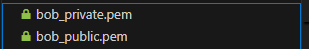
*(Show creation of bob_public.pem and bob_private.pem.)*

---

#### **2️⃣ Encryption**

**Screenshot:** 
   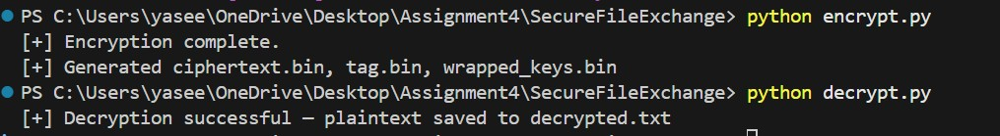
*(Show AES‑CTR encryption and RSA key wrap execution.)*

---

#### **3️⃣ Decryption & Integrity Verification**

**Screenshot:** 


---

#### **4️⃣ Testing Outcomes**

| **Test Case**         | **Expected Result**                   | **Observed Outcome**                 | **Status (Pass/Fail)** |
| --------------------- | ------------------------------------- | ------------------------------------ | ---------------------- |
| Successful Round-Trip | Decrypted text matches original       | Output matched original `secret.txt` | **Pass**               |
| Tamper Test           | Integrity check fails (HMAC mismatch) | “IV mismatch – something is wrong.”  | **Pass**               |
| Wrong RSA Key         | Decryption fails – cannot unwrap key  | “[!] RSA unwrap failed — wrong key?” | **Pass**               |


---

#### **Analysis Questions**

1. Why do we combine **RSA** and **AES** instead of encrypting the file directly with RSA?
   We combine RSA and AES because RSA is computationally expensive, structurally limited, and not suitable for bulk data encryption. RSA can only encrypt messages up to the size of its modulus (minus padding), making large files impossible to encrypt directly. Even if it were technically possible, RSA operations are orders of magnitude slower than symmetric algorithms like AES, which are optimized for high-throughput stream or block encryption. AES can efficiently encrypt arbitrarily large files, while RSA is used only to protect the comparatively tiny AES session key. This design yields both performance and security benefits, and is the industry-standard hybrid cryptosystem model used in protocols like TLS.
2. What would happen if you reused the **IV** in AES-CTR?
   Reusing an IV in AES-CTR mode is catastrophic because CTR uses the IV as a nonce for generating the keystream. If two messages are encrypted with the same key and IV, the same keystream is generated for both, and XORing the ciphertexts cancels out the keystream, revealing the XOR of the plaintexts. From there, an attacker can recover each plaintext if even partial structure is known. This transforms the cipher effectively into a two-time pad, which is insecure for exactly the same reasons as the reused one-time pad. Therefore, IV uniqueness—not secrecy—is essential to maintain confidentiality.
3. How does **RSA-OAEP** protect the symmetric keys compared to basic RSA encryption?
   RSA-OAEP (Optimal Asymmetric Encryption Padding) adds probabilistic padding and structured randomness to plaintexts before RSA encryption, preventing deterministic ciphertexts and thwarting a wide array of attacks, including chosen-ciphertext attacks and partial-information leakages. Basic RSA is deterministic, meaning the same plaintext produces the same ciphertext every time, enabling replay attacks, plaintext-guessing attacks, and adaptive oracle attacks. OAEP’s internal hash-based mask generation functions ensure that the encrypted AES key is semantically secure and resists modifications or padding-oracle exploitation. Thus, OAEP transforms RSA into a CCA-secure mechanism appropriate for protecting symmetric keys.
4. Why is the **HMAC key** different from the **AES encryption key**? What are the risks of reusing the same key for both?
   The HMAC key must be independent from the AES encryption key because cryptographic keys should be domain-separated to avoid cross-protocol leakage and structural correlations. AES keys are used in block-cipher operations while HMAC keys are used in keyed hash constructions; reusing the same key risks enabling attacks where information about one primitive leaks into the other. In some constructions, an attacker could exploit predictable relationships between cipher outputs and MAC tags to recover the key or perform forgery. Using separate keys eliminates this class of multi-use vulnerabilities and complies with best practices for key separation in cryptographic systems.
5. What specific attacks can **HMAC-SHA256** defend against in this file exchange scenario?
   HMAC-SHA256 provides message authentication and integrity, protecting against tampering, truncation, reordering, and ciphertext substitution attacks. Specifically, it prevents an adversary from modifying the IV, altering ciphertext blocks, injecting new blocks, or replaying old encrypted payloads without detection. It also protects against attempts to exploit bit-flipping vulnerabilities in CTR mode, where a single flipped bit in the ciphertext flips the corresponding plaintext bit deterministically. By authenticating all encryption parameters, HMAC-SHA256 ensures that any unauthorized modification is immediately detectable, preventing both active man-in-the-middle attacks and silent corruption.
6. Why do we authenticate both the **IV** and the **ciphertext** with HMAC instead of only the ciphertext?
   The IV in CTR mode directly influences the keystream and thus the decryption of every byte of ciphertext. If an attacker can alter the IV without detection, they can manipulate the resulting plaintext arbitrarily, even when the ciphertext is authenticated. Authenticating only the ciphertext would enable adversaries to perform controlled modifications, causing predictable bit-flips in the decrypted message or forcing keystream reuse scenarios. Therefore, authenticating both the IV and ciphertext preserves the integrity and correctness of the cryptographic state, ensuring that any manipulation of encryption parameters triggers failure before decryption.
7. How would the system behave if the HMAC check fails during decryption, and why is this behavior important?
   If the HMAC check fails, the system should immediately abort the decryption process, discard all cryptographic outputs, and return a generic authentication-failure error. This behavior is crucial because it prevents attackers from learning any information about the plaintext or internal cryptographic state. Prematurely decrypting data before verification would expose the system to padding-oracle-like side channels, bit-flipping exploits, and subtle timing differences. By failing fast and consistently, the system enforces a fail-safe default that treats all unauthenticated data as untrustworthy, aligning with best practices for secure protocol design.
8. Why is the **encrypt-then-MAC** design used instead of MAC-then-encrypt or encrypt-and-MAC?
   Encrypt-then-MAC is the cryptographic community’s preferred design because it provides strong, composable security: confidentiality holds even in the presence of arbitrary tampering, and integrity is preserved independently of the encryption algorithm. MAC-then-encrypt, used historically in SSL/TLS 1.0, can leak integrity information through padding oracles and is no longer considered secure. Encrypt-and-MAC provides no clear ordering guarantees and can result in authenticated but unauthenticable states where ciphertext modifications remain undetected until after partial decryption. Encrypt-then-MAC ensures that no ciphertext is decrypted unless the authentication tag is verified first, making it the safest and most robust construction.
9.  Which **NIST CSF Function(s)** and **SP 800-53 Rev. 5 controls** does this hybrid cryptosystem most directly support?
    This hybrid cryptosystem primarily supports the Protect (PR) function of the NIST Cybersecurity Framework, particularly under categories PR.DS (Data Security) and PR.AC (Access Control). Relevant SP 800-53 Rev. 5 controls include SC-12 (Cryptographic Key Establishment and Management), SC-13 (Cryptographic Protection), SC-28 (Protection of Information at Rest), SC-23 (Session Authenticity), SC-8 (Transmission Confidentiality and Integrity), and IA-7 (Cryptographic Module Authentication). These controls address secure key distribution, encryption of sensitive data, integrity verification, and authenticated communication, all of which are directly fulfilled by the RSA-AES hybrid design with HMAC authentication.
10. How does this implementation reflect the principles of **least privilege**, **fail-safe defaults**, and **trust boundaries** at the cryptographic level?
    The implementation demonstrates least privilege by ensuring that each key (AES, HMAC, RSA private key) is used exclusively for its intended cryptographic domain, preventing any component from overreaching or accessing functions beyond necessity. It embodies fail-safe defaults by rejecting any ciphertext or IV that does not authenticate via HMAC, ensuring that the system defaults to secure behavior under error or attack. Finally, it enforces trust boundaries by clearly separating roles: RSA handles key exchange, AES handles confidentiality, HMAC handles integrity, and each boundary is validated before trust is granted. This layered separation of responsibilities prevents cascading failures and enhances the overall security posture.


